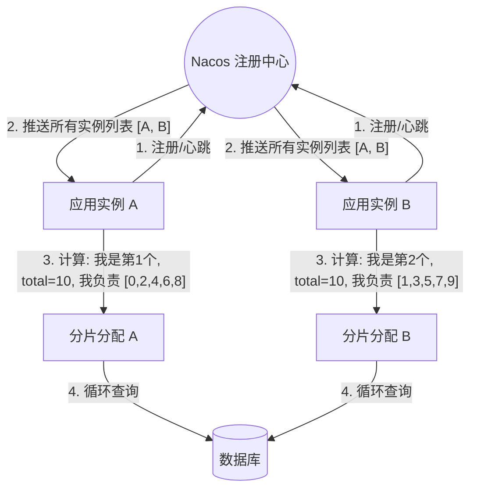
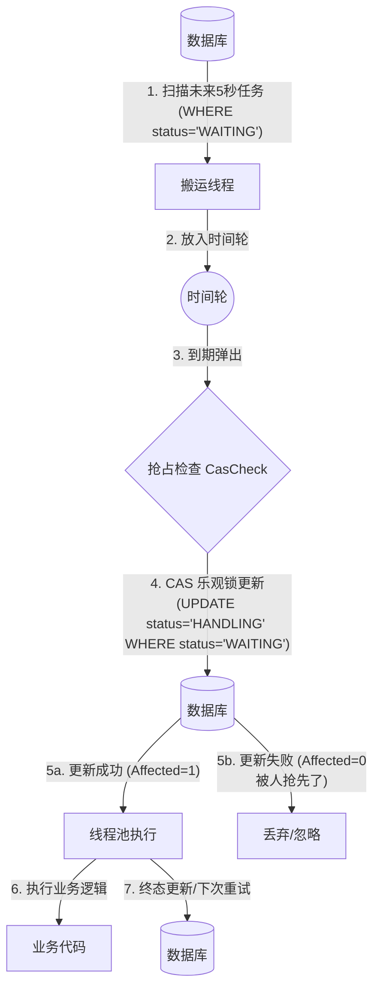
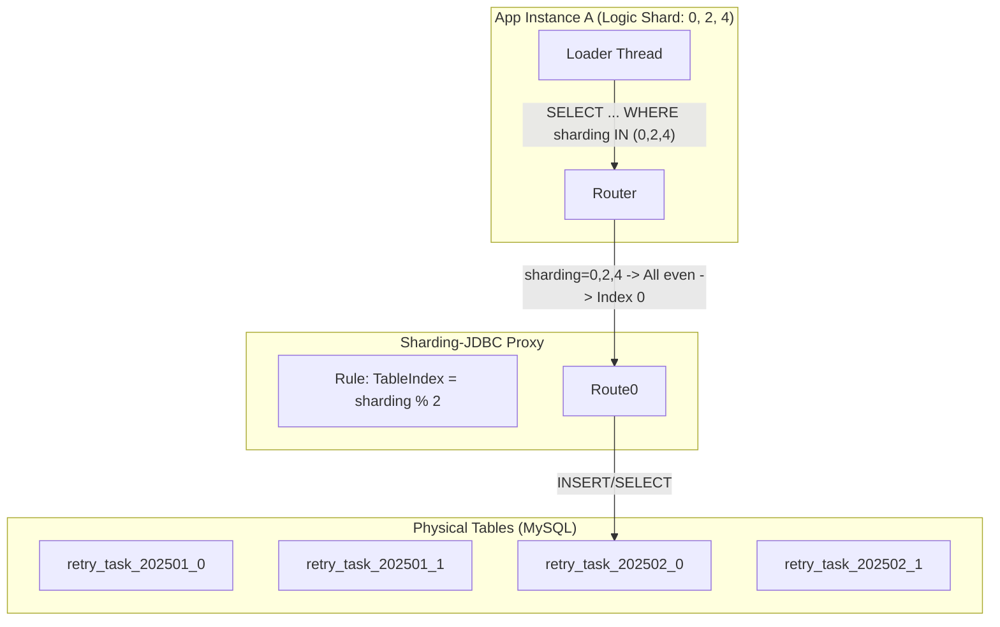
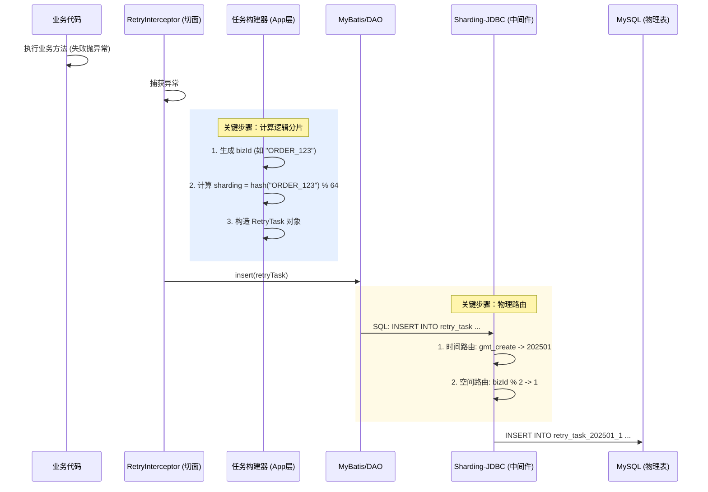

# Chat Conversation

Note: _This is purely the output of the chat conversation and does not contain any raw data, codebase snippets, etc. used to generate the output._

### User Input

RetryInterceptor 这个类解释下

*Searched filesystem*

### User Input

Continue

*Viewed [RetryInterceptor.java](file:///d:/workspace/easy-retry/easy-retry-extensions/easy-retry-spring-extension/src/main/java/com/alibaba/easyretry/extension/spring/aop/RetryInterceptor.java) *

### Planner Response

[RetryInterceptor](cci:2://file:///d:/workspace/easy-retry/easy-retry-extensions/easy-retry-spring-extension/src/main/java/com/alibaba/easyretry/extension/spring/aop/RetryInterceptor.java:19:0-57:1) 是 `easy-retry-spring-extension` 模块中的一个核心类，它的主要作用是通过 Spring AOP（面向切面编程）拦截带有 `@EasyRetryable` 注解的方法，并将这些方法的执行逻辑委托给 `easy-retry` 的核心重试机制 ([Retryer](cci:1://file:///d:/workspace/easy-retry/easy-retry-extensions/easy-retry-spring-extension/src/main/java/com/alibaba/easyretry/extension/spring/aop/RetryInterceptor.java:43:1-56:2))。

以下是该类的详细解析：

### 1. 核心定位
*   **Spring AOP 切面**: 类上标注了 `@Aspect`，说明它是一个切面，用于在运行时动态增强代码。
*   **拦截入口**: `@Around("@annotation(retryable)")` 标注在 [around](cci:1://file:///d:/workspace/easy-retry/easy-retry-extensions/easy-retry-spring-extension/src/main/java/com/alibaba/easyretry/extension/spring/aop/RetryInterceptor.java:28:1-36:2) 方法上，表示它会拦截所有被 `@EasyRetryable` 注解修饰的方法。

### 2. 主要逻辑 ([around](cci:1://file:///d:/workspace/easy-retry/easy-retry-extensions/easy-retry-spring-extension/src/main/java/com/alibaba/easyretry/extension/spring/aop/RetryInterceptor.java:28:1-36:2) 方法)
这是拦截器的核心执行流程：
1.  **防止递归重试**:
    ```java
    if (RetryIdentify.isOnRetry()) {
        return invocation.proceed();
    }
    ```
    它首先检查当前线程上下文是否已经处于“重试执行中”的状态 (`RetryIdentify.isOnRetry()`)。如果是，说明这已经是重试框架在调度执行该方法了，因此直接执行业务逻辑 (`invocation.proceed()`)，避免死循环或重复触发重试任务生成。

2.  **构建并执行重试**:
    ```java
    Retryer<Object> retryer = determineTargetRetryer(invocation, retryable);
    return retryer.call(invocation::proceed);
    ```
    如果不是重试中，则构建一个 [Retryer](cci:1://file:///d:/workspace/easy-retry/easy-retry-extensions/easy-retry-spring-extension/src/main/java/com/alibaba/easyretry/extension/spring/aop/RetryInterceptor.java:43:1-56:2) 执行器，并将原本的方法调用 (`invocation::proceed`) 包装成一个任务交给 [Retryer](cci:1://file:///d:/workspace/easy-retry/easy-retry-extensions/easy-retry-spring-extension/src/main/java/com/alibaba/easyretry/extension/spring/aop/RetryInterceptor.java:43:1-56:2) 执行。[Retryer](cci:1://file:///d:/workspace/easy-retry/easy-retry-extensions/easy-retry-spring-extension/src/main/java/com/alibaba/easyretry/extension/spring/aop/RetryInterceptor.java:43:1-56:2) 会根据配置决定是直接执行、仅记录任务还是进行异步重试。

### 3. 构建重试器 ([determineTargetRetryer](cci:1://file:///d:/workspace/easy-retry/easy-retry-extensions/easy-retry-spring-extension/src/main/java/com/alibaba/easyretry/extension/spring/aop/RetryInterceptor.java:43:1-56:2) 方法)
这个私有方法负责收集上下文信息来构建 [Retryer](cci:1://file:///d:/workspace/easy-retry/easy-retry-extensions/easy-retry-spring-extension/src/main/java/com/alibaba/easyretry/extension/spring/aop/RetryInterceptor.java:43:1-56:2) 实例，使用了 `RetryerBuilder`：
*   **执行器信息**:
    *   `withExecutorName`: 获取当前 Spring Bean 的 ID。
    *   `withExecutorMethodName`: 获取当前被调用的方法名。
    *   这两个参数用于在重试发生时，准确找到需要反射调用的目标方法。
*   **参数传递**: `withArgs(invocation.getArgs())` 保存方法入参，以便重试时回放。
*   **配置注入**: `withConfiguration(retryConfiguration)` 注入全局重试配置。
*   **异常处理**: `withReThrowException` 根据注解配置决定当首次执行失败时是否抛出异常。
*   **结果判断 (SPEL)**:
    ```java
    if (StringUtils.isNotBlank(retryable.resultCondition())) {
        retryerBuilder.withResultPredicate(new SPELResultPredicate<>(retryable.resultCondition()));
    }
    ```
    如果在注解中配置了 `resultCondition`（SPEL 表达式），它会添加一个断言谓词。这意味着可以通过表达式判断返回结果是否符合预期，如果不符合也可以触发重试。

### 4. 总结
[RetryInterceptor](cci:2://file:///d:/workspace/easy-retry/easy-retry-extensions/easy-retry-spring-extension/src/main/java/com/alibaba/easyretry/extension/spring/aop/RetryInterceptor.java:19:0-57:1) 是连接 Spring 业务代码和 EasyRetry 重试内核的桥梁。它透明地接管了业务方法的调用，负责提取元数据（Bean、方法、参数）并交给 [Retryer](cci:1://file:///d:/workspace/easy-retry/easy-retry-extensions/easy-retry-spring-extension/src/main/java/com/alibaba/easyretry/extension/spring/aop/RetryInterceptor.java:43:1-56:2)，使得用户只需加一个注解 (`@EasyRetryable`) 就能实现重试逻辑，而无需手动编写重试代码。

### User Input

这个框架有设计filter 和 process相关的东西，在里面起什么作用，怎么串联的？

### User Input

Continue

### User Input

Continue

*Searched filesystem*

*Searched filesystem*

*Edited relevant file*

*Edited relevant file*

*Viewed [RetryFilter.java](file:///d:/workspace/easy-retry/easy-retry-common/src/main/java/com/alibaba/easyretry/common/filter/RetryFilter.java) *

*Viewed [AbstractRetryFilter.java](file:///d:/workspace/easy-retry/easy-retry-common/src/main/java/com/alibaba/easyretry/common/filter/AbstractRetryFilter.java) *

*Viewed [RetryProcessor.java](file:///d:/workspace/easy-retry/easy-retry-common/src/main/java/com/alibaba/easyretry/common/processor/RetryProcessor.java) *

*Viewed [RetryerBuilder.java](file:///d:/workspace/easy-retry/easy-retry-core/src/main/java/com/alibaba/easyretry/core/RetryerBuilder.java) *

*Viewed [SyncRetryerBuilder.java](file:///d:/workspace/easy-retry/easy-retry-core/src/main/java/com/alibaba/easyretry/core/SyncRetryerBuilder.java) *

*Viewed [PersistenceRetryerBuilder.java](file:///d:/workspace/easy-retry/easy-retry-core/src/main/java/com/alibaba/easyretry/core/PersistenceRetryerBuilder.java) *

*Viewed [RetryContext.java](file:///d:/workspace/easy-retry/easy-retry-common/src/main/java/com/alibaba/easyretry/common/RetryContext.java) *

*Edited relevant file*

*Viewed [SyncRetryer.java](file:///d:/workspace/easy-retry/easy-retry-core/src/main/java/com/alibaba/easyretry/core/SyncRetryer.java) *

*Viewed [PersistenceRetryer.java](file:///d:/workspace/easy-retry/easy-retry-core/src/main/java/com/alibaba/easyretry/core/PersistenceRetryer.java) *

*Viewed [AbstractRetrySyncExecutor.java](file:///d:/workspace/easy-retry/easy-retry-common/src/main/java/com/alibaba/easyretry/common/AbstractRetrySyncExecutor.java) *

*Viewed [RetryConfiguration.java](file:///d:/workspace/easy-retry/easy-retry-common/src/main/java/com/alibaba/easyretry/common/RetryConfiguration.java) *

*Searched filesystem*

*Grep searched codebase*

*Grep searched codebase*

*Viewed [DefaultRetryFilterInvocationHandler.java](file:///d:/workspace/easy-retry/easy-retry-core/src/main/java/com/alibaba/easyretry/core/filter/DefaultRetryFilterInvocationHandler.java) *

*Viewed [DefaultRetryStrategy.java](file:///d:/workspace/easy-retry/easy-retry-core/src/main/java/com/alibaba/easyretry/core/strategy/DefaultRetryStrategy.java) *

*Viewed [PersistenceRetryExecutor.java](file:///d:/workspace/easy-retry/easy-retry-core/src/main/java/com/alibaba/easyretry/core/PersistenceRetryExecutor.java) *

*Searched filesystem*

*Edited relevant file*

### User Input

com.alibaba.easyretry.core.PersistenceRetryExecutor
		RetryEvent onRetryEvent = null;
		switch (handleResult) {
			case SUCCESS:
				finish(context);
				onRetryEvent = new SuccessOnRetryEvent(context);
				break;
			case STOP:
				stop(context);
				onRetryEvent = new StopOnRetryEvent(context);
				break;
			case FAILURE:
				onRetryEvent = new FailureOnRetryEvent(context);
		}
		retryConfiguration.getRetryEventMulticaster().multicast(onRetryEvent);

这里是在干嘛？

### Planner Response

这段代码是 **重试任务执行后的“收尾”与“通知”阶段**。

在使用 [Processor](cci:2://file:///d:/workspace/easy-retry/easy-retry-common/src/main/java/com/alibaba/easyretry/common/processor/RetryProcessor.java:5:0-9:1) 处理完重试逻辑（执行业务方法、计算下次重试时间、更新数据库状态）后，这段代码根据处理结果 (`handleResult`) 做最后的 **状态流转** 和 **事件广播**。

具体干了三件事：

### 1. 根据结果更新任务最终状态
`handleResult` 是上一步 `processor.process()` 返回的执行结果，代码通过 switch 进行分发：

*   **`SUCCESS` (执行成功)**:
    *   **动作**: 调用 [finish(context)](cci:1://file:///d:/workspace/easy-retry/easy-retry-core/src/main/java/com/alibaba/easyretry/core/PersistenceRetryExecutor.java:97:1-109:2)。
    *   **含义**: 业务方法这次重试成功了。
    *   **底层**: [finish](cci:1://file:///d:/workspace/easy-retry/easy-retry-core/src/main/java/com/alibaba/easyretry/core/PersistenceRetryExecutor.java:97:1-109:2) 方法会调用 `RetryTaskAccess.finishRetryTask`，通常会将数据库中的任务状态更新为“完成”，防止再次被扫描到。

*   **`STOP` (停止重试)**:
    *   **动作**: 调用 [stop(context)](cci:1://file:///d:/workspace/easy-retry/easy-retry-core/src/main/java/com/alibaba/easyretry/core/PersistenceRetryExecutor.java:111:1-123:2)。
    *   **含义**: 业务方法这次依然失败，并且**不应该再重试了**（例如达到了最大重试次数配置，或者触发了停止策略）。
    *   **底层**: [stop](cci:1://file:///d:/workspace/easy-retry/easy-retry-core/src/main/java/com/alibaba/easyretry/core/PersistenceRetryExecutor.java:111:1-123:2) 方法会调用 `RetryTaskAccess.stopRetryTask`，通常将任务标记为“已停止”或“失败归档”，不再调度。

*   **`FAILURE` (本次失败，但即将在未来重试)**:
    *   **动作**: 没有调用 [finish](cci:1://file:///d:/workspace/easy-retry/easy-retry-core/src/main/java/com/alibaba/easyretry/core/PersistenceRetryExecutor.java:97:1-109:2) 或 [stop](cci:1://file:///d:/workspace/easy-retry/easy-retry-core/src/main/java/com/alibaba/easyretry/core/PersistenceRetryExecutor.java:111:1-123:2)。
    *   **含义**: 业务方法失败了，但还可以继续重试（没达到最大次数）。
    *   **底层**: 此时不需要将任务标为结束。新的“下次执行时间”已经在之前的 `processor.process()` 阶段更新到数据库里了，所以这里只需要发个通知即可。

### 2. 构建生命周期事件
每种状态对应一个事件对象，这些事件都携带了当前的上下文 (`context`)：
*   `SuccessOnRetryEvent`: 重试成功事件。
*   `StopOnRetryEvent`: 重试结束（放弃）事件。
*   `FailureOnRetryEvent`: 重试失败（但还会继续）事件。

### 3. 广播事件
```java
retryConfiguration.getRetryEventMulticaster().multicast(onRetryEvent);
```
这是**观察者模式**的应用。
*   **目的**: 解耦核心逻辑与扩展逻辑。
*   **作用**: 系统中可能有多个监听器 (`RetryListener`) 关注这些事件。
    *   例如：你可以注册一个监听器，在收到 `StopOnRetryEvent` (重试彻底失败) 时发送钉钉/邮件告警，或者在收到 `SuccessOnRetryEvent` 时记录监控指标。

**总结：** 这段代码负责**“盖棺定论”**（修改数据库最终状态）和**“广而告之”**（发送事件通知监听者）。

### User Input

这个框架用了 责任链模式 观察者模式还有那些模式的实践?

*Edited relevant file*

*Searched filesystem*

*Searched filesystem*

*Searched filesystem*

*Edited relevant file*

*Grep searched codebase*

*Grep searched codebase*

*Grep searched codebase*

*Edited relevant file*

### User Input

抛开这些设计模式，这个框架是在干嘛

### Planner Response

抛开那些花哨的设计模式，**`EasyRetry` 这个框架的核心就是在干一件事：**

**“也就是帮你把失败的方法，过一会再重试一次，直到成功或者放弃。”**

想象你在玩一个游戏，过关失败了。
1.  **普通代码**：游戏直接结束 (Game Over)，报错抛异常。
2.  **EasyRetry**：它像是一个存档读档机制。
    *   **存档 (Persistence)**：你挂了，它把你的当前进度（方法参数、类名）记在小本本（数据库）上。
    *   **读档 (Retry)**：它有一个后台线程，过一会（WaitStrategy）看看小本本，把你拉起来再打一次。
    *   **放弃 (StopStrategy)**：如果你连挂了 5 次，它觉得你太菜了，就不让你试了，发个通知（Event）告诉你彻底失败。

**它解决了什么痛点？**
1.  **网络抖动**：调用别的服务超时了，可能下一秒就好了。你不必自己写 `try-catch` 和 `while` 循环去重试。
2.  **防丢单**：如果你的服务重启了，内存里的重试任务就没了。EasyRetry 把它存到数据库里，重启后还能继续重试，保证任务不丢失。
3.  **优雅**：你只需要加一个注解 `@EasyRetryable`，不需要在业务代码里写一堆乱七八糟的重试逻辑。

**总结一句话：**
它是一个**带持久化（防丢失）功能的自动重试管家**。

### User Input

框架的等待是怎么实现的？是通过睡眠吗？

*Edited relevant file*

*Searched filesystem*

*Grep searched codebase*

*Grep searched codebase*

*Viewed [GuavaRetrySyncExecutor.java](file:///d:/workspace/easy-retry/easy-retry-extensions/easy-retry-guava-extension/src/main/java/com/alibaba/easyretry/extension/guava/GuavaRetrySyncExecutor.java) *

*Grep searched codebase*

*Searched filesystem*

*Searched filesystem*

*Viewed [SimpleRetryContainer.java](file:///d:/workspace/easy-retry/easy-retry-core/src/main/java/com/alibaba/easyretry/core/container/SimpleRetryContainer.java) *

*Grep searched codebase*

*Grep searched codebase*

*Edited relevant file*

### User Input

并没有发现next_retry_time 字段。
@Data
@Accessors(chain = true)
public class RetryTaskPO {

	/**
	 * 主键id
	 */
	private Long id;

	/**
	 * 分片id
	 */
	private String sharding;

	/**
	 * 业务信息
	 */
	private String bizId;

	/**
	 * 执行者名称
	 */
	private String executorName;

	/**
	 * 执行者方法
	 */
	private String executorMethodName;

	/**
	 * @see RetryTaskStatusEnum
	 */
	private Integer retryStatus;

	private String argsStr;

	private Date gmtCreate;

	private Date gmtModified;

	private String extAttrs;
}


*Edited relevant file*

*Searched filesystem*

*Grep searched codebase*

*Grep searched codebase*

*Viewed [RetryTaskPO.java](file:///d:/workspace/easy-retry/easy-retry-extensions/easy-retry-mybatis-extension/src/main/java/com/alibaba/easyretry/extension/mybatis/po/RetryTaskPO.java) *

*Searched filesystem*

*Searched filesystem*

*Grep searched codebase*

*Viewed [RetryTaskDAO.java](file:///d:/workspace/easy-retry/easy-retry-extensions/easy-retry-mybatis-extension/src/main/java/com/alibaba/easyretry/extension/mybatis/dao/RetryTaskDAO.java) *

*Searched filesystem*

*Viewed [easy-retry-task-mapper.xml](file:///d:/workspace/easy-retry/easy-retry-extensions/easy-retry-mybatis-extension/src/main/resources/dal/easyretry/mapper/easy-retry-task-mapper.xml) *

*Viewed [DefaultRetryStrategy.java](file:///d:/workspace/easy-retry/easy-retry-core/src/main/java/com/alibaba/easyretry/core/strategy/DefaultRetryStrategy.java) *

*Viewed [SimpleRetryContainer.java](file:///d:/workspace/easy-retry/easy-retry-core/src/main/java/com/alibaba/easyretry/core/container/SimpleRetryContainer.java) *

### User Input

	public boolean shouldWait(RetryContext context) {
		MaxAttemptsPersistenceRetryContext maxAttemptsPersistenceRetryContext
			= (MaxAttemptsPersistenceRetryContext)context;
		internalTimeMap.putIfAbsent(context.getId(), 0L);
		Long priority = maxAttemptsPersistenceRetryContext.getNextRetryTime(TimeUnit.MILLISECONDS);
		if (Objects.isNull(priority)) {
			priority = 0L;
		}
		return System.currentTimeMillis() < priority;
	}

这个就是决定能不能重试的逻辑吗？

### Planner Response

是的，代码片段中的 [shouldWait](cci:1://file:///d:/workspace/easy-retry/easy-retry-core/src/main/java/com/alibaba/easyretry/core/strategy/DefaultRetryStrategy.java:38:1-48:2) 方法正是决定**“当前是否是重试时机”**的核心逻辑。

### 逻辑解析

```java
public boolean shouldWait(RetryContext context) {
    // ... 类型转换 ...

    // 1. 初始化 internalTimeMap
    // 如果这个任务ID是第一次在当前内存里遇到，记录它的初始时间为 0
    internalTimeMap.putIfAbsent(context.getId(), 0L);

    // 2. 获取下次执行时间 (Deadline)
    // 从 context 中获取“下次重试时间戳”(NextRetryTime)
    // 这个时间戳是在上次失败时（backOff 方法里）计算好并因存入 context 的
    Long priority = maxAttemptsPersistenceRetryContext.getNextRetryTime(TimeUnit.MILLISECONDS);
    if (Objects.isNull(priority)) {
        priority = 0L;
    }

    // 3. 核心判断
    // 如果 当前系统时间 < 下次重试时间戳，返回 true (应该等待/不应该跑)
    // 如果 当前系统时间 >= 下次重试时间戳，返回 false (不用等了/赶紧跑)
    return System.currentTimeMillis() < priority;
}
```

### 它是如何工作的？

1.  **初次执行**: 任务刚从数据库捞出来，如果之前没计算过 `NextRetryTime`（比如它是刚创建的新任务），`priority` 可能是 0 或 null。
    *   `System.currentTimeMillis() < 0` 为 `false`。
    *   **结果**: [shouldWait](cci:1://file:///d:/workspace/easy-retry/easy-retry-core/src/main/java/com/alibaba/easyretry/core/strategy/DefaultRetryStrategy.java:38:1-48:2) 返回 `false` -> **立即执行**。

2.  **执行失败**:
    *   如果任务执行失败，会调用同类中的 [backOff](cci:1://file:///d:/workspace/easy-retry/easy-retry-core/src/main/java/com/alibaba/easyretry/core/strategy/DefaultRetryStrategy.java:50:1-77:2) 方法。
    *   [backOff](cci:1://file:///d:/workspace/easy-retry/easy-retry-core/src/main/java/com/alibaba/easyretry/core/strategy/DefaultRetryStrategy.java:50:1-77:2) 会计算一个新的时间戳（例如 `now + 5000ms`），并调用 `context.setNextRetryTime(...)` 更新上下文。

3.  **再次检查**:
    *   任务被放回队列/下一轮循环再次进入 [shouldWait](cci:1://file:///d:/workspace/easy-retry/easy-retry-core/src/main/java/com/alibaba/easyretry/core/strategy/DefaultRetryStrategy.java:38:1-48:2)。
    *   此时 `priority` 是 `now + 5000ms`。
    *   `System.currentTimeMillis() < priority` 为 `true`。
    *   **结果**: [shouldWait](cci:1://file:///d:/workspace/easy-retry/easy-retry-core/src/main/java/com/alibaba/easyretry/core/strategy/DefaultRetryStrategy.java:38:1-48:2) 返回 `true` -> **继续等待**，不执行业务逻辑。

### 关于 "internalTimeMap" 的补充
代码里还有一行 `internalTimeMap.putIfAbsent(...)`。这个 map 在 [DefaultRetryStrategy](cci:2://file:///d:/workspace/easy-retry/easy-retry-core/src/main/java/com/alibaba/easyretry/core/strategy/DefaultRetryStrategy.java:14:0-84:1) 里主要用于计算**指数退避**（Exponential Backoff）的基数，记录该任务上一次的间隔时间，以便在下一次计算时翻倍，而不是直接用于 [shouldWait](cci:1://file:///d:/workspace/easy-retry/easy-retry-core/src/main/java/com/alibaba/easyretry/core/strategy/DefaultRetryStrategy.java:38:1-48:2) 的判定。[shouldWait](cci:1://file:///d:/workspace/easy-retry/easy-retry-core/src/main/java/com/alibaba/easyretry/core/strategy/DefaultRetryStrategy.java:38:1-48:2) 的判定依据纯粹是 `context` 中的 `NextRetryTime`。

### User Input

代码里还有一行 internalTimeMap.putIfAbsent(...)。这个 map 在 
DefaultRetryStrategy
 里主要用于计算指数退避（Exponential Backoff）的基数，记录该任务上一次的间隔时间，以便在下一次计算时翻倍。
这是什么意思？

### Planner Response

简单来说，`internalTimeMap` 就像是这个策略的**“记账本”**。它记住了**“上一次为了这个任务我们等了多久”**。

这对于实现“重试次数越多，等待时间越长”（即指数退避或变种策略）是必须的，因为计算**这一次**要等多久，往往需要依赖**上一次**的数据。

让我们看下 [backOff](cci:1://file:///d:/workspace/easy-retry/easy-retry-core/src/main/java/com/alibaba/easyretry/core/strategy/DefaultRetryStrategy.java:50:1-77:2) 方法里的核心公式：

```java
// 获取上次等了多久（如果是第一次，就是 0）
Long lastInternalTime = internalTimeMap.get(context.getId());

// 公式：下一次等待时间 = 当前重试次数 * (上次等待时间 + 基础时间5秒)
long nextInternalTime = retryTime * (lastInternalTime + BASE_INTERNAL_TIME);

// 记账：把这次算出来的等待时间存回去，供下一次计算使用
internalTimeMap.put(context.getId(), nextInternalTime);
```

### 举个例子推演一下（假设 BASE_INTERNAL_TIME = 5秒）

*   **第 1 次重试** (retryTime=1, lastInternalTime=0):
    *   计算：`1 * (0 + 5000) = 5000ms` (5秒)
    *   **结果**: 等 5 秒。
    *   *记账本更新*: id -> 5000

*   **第 2 次重试** (retryTime=2, lastInternalTime=5000):
    *   计算：`2 * (5000 + 5000) = 20000ms` (20秒)
    *   **结果**: 等 20 秒。
    *   *记账本更新*: id -> 20000

*   **第 3 次重试** (retryTime=3, lastInternalTime=20000):
    *   计算：`3 * (20000 + 5000) = 75000ms` (75秒)
    *   **结果**: 等 75 秒。
    *   *记账本更新*: id -> 75000

### 总结
这就是**指数退避（Exponential Backoff）**（虽然这个具体公式比较激进，不仅仅是 2 的幂次）：
1.  **目的**: 防止既然系统已经挂了，还频繁重试把它彻底打死。
2.  **实现**: 用 `internalTimeMap` 记住上一次的值，就像滚雪球一样，让等待时间随着重试次数迅速膨胀。如果不记录上一次的时间，只根据重试次数算（比如 `retryTime * 5000`），那就是线性增长（5秒, 10秒, 15秒），这就叫线性退避。

### User Input

Long priority = maxAttemptsPersistenceRetryContext.getNextRetryTime(TimeUnit.MILLISECONDS);

这里是拿的上一次的重试时间吗？

### Planner Response

不是“上一次的重试时间”，准确地说是**“下一次允许重试的时间点” (Wait Deadline)**。

### 详细解释

1.  **定义**: `NextRetryTime` = `Current Time` (计算发生时) + `Wait Interval` (需要等待的时长)。
    *   例如：现在是 12:00:00，计算出来要等 5 秒。
    *   那么 `NextRetryTime` 就是 `12:00:05`。

2.  **设置时机**: 它是在**上一次重试失败后**，在 [backOff](cci:1://file:///d:/workspace/easy-retry/easy-retry-core/src/main/java/com/alibaba/easyretry/core/strategy/DefaultRetryStrategy.java:50:1-77:2) 方法里设置的：
    ```java
    // 发生在 backOff 方法中 (上一次失败时)
    long nextInternalTime = ...; // 算出要等多久 (比如 5000ms)
    // 算出具体的未来时间点 (比如 12:00:05) 并存入 context
    maxAttemptsPersistenceRetryContext.setNextRetryTime(System.currentTimeMillis() + nextInternalTime, ...);
    ```

3.  **获取时机**: 它是在**当前这次尝试检查**时，在 [shouldWait](cci:1://file:///d:/workspace/easy-retry/easy-retry-core/src/main/java/com/alibaba/easyretry/core/strategy/DefaultRetryStrategy.java:38:1-48:2) 方法里获取的：
    ```java
    // 发生在 shouldWait 方法中 (当前检查时)
    // 我问 context：我最早什么时候能跑？
    Long priority = maxAttemptsPersistenceRetryContext.getNextRetryTime(...);
    // 假设拿到了 12:00:05
    // 我看一眼表：现在才 12:00:03，那不行，还得等 (System.currentTimeMillis() < priority 为 true)
    ```

### 总结
`priority` 拿到的是一个**未来的时间戳**，它是**“门禁卡”上的生效时间**。没到这个点，门禁系统 ([shouldWait](cci:1://file:///d:/workspace/easy-retry/easy-retry-core/src/main/java/com/alibaba/easyretry/core/strategy/DefaultRetryStrategy.java:38:1-48:2)) 就不让你过。

### User Input

这个版本的实现比较简单：先把任务捞出来，在内存里判断到没到时间。没到时间就先不跑，等会再看

### Planner Response

是的，您的总结非常准确。

这个版本的调度策略可以概括为：**“全量拉取，内存过滤”**。

### 详细对比

| 特性 | 这个版本的实现 (Version 1.0 风格) | 成熟的生产级实现 (如 Quartz, XXL-JOB) |
| :--- | :--- | :--- |
| **筛选时机** | **内存中** (In-Memory) | **数据库中** (In-Database) |
| **SQL逻辑** | `SELECT * FROM task` (查所有未完成的) | `SELECT * FROM task WHERE next_exec_time <= now()` |
| **IO开销** | **高**。每一轮不管任务到没到时间，都会被从磁盘读出来，占用带宽和内存。 | **低**。只读取当前那一刻真正需要跑的任务。 |
| **内存开销** | **高**。如果有 10万 个任务要明天跑，它们现在就会占用 JVM 内存。 | **低**。未到期的任务安静地待在磁盘里，不占应用内存。 |
| **适用场景** | 任务量较少，重试间隔短（秒级/分钟级）。 | 海量任务，或者长周期延迟任务（如两天后重试）。 |

### 存在的隐患
这种“内存过滤”的设计，在任务量大时会成为瓶颈：
1.  **空转浪费**: 即使所有任务都要 1 小时后执行，调度线程还是会死循环地把它们拉出来，看一眼“哦没到时间”，再塞回去。这会把 CPU 和 数据库 IO 跑满，做无用功。
2.  **OOM 风险**: 如果堆积的任务太多（例如系统故障停了一天，积压了百万级任务），一次性拉取或者在内存 Map 里维护状态，可能会导致 `OutOfMemoryError`。

不过，对于一个轻量级的、主要解决“短时间抖动”重试的框架来说，这个实现胜在**简单**，不需要引入复杂的基于时间的索引和分片调度逻辑。

### User Input

相对于把next_exec_time 下一次的执行时间存到了数据库，只有当前时间大于等于next_exec_time 才拿出来

### Planner Response

是的，将 `next_exec_time`（下一次执行时间）存储在数据库，并在 SQL 查询时直接过滤 `WHERE next_exec_time <= now()`，这是更成熟、性能更好的设计。

它们的对比如下：

### 方案对比：内存过滤 vs 数据库过滤

| 维度 | 方案 A (当前 EasyRetry): 内存过滤 | 方案 B (推荐优化): 数据库过滤 |
| :--- | :--- | :--- |
| **核心逻辑** | `SELECT * FROM task` <br> `if (now < task.nextTime) continue;` | `SELECT * FROM task WHERE next_exec_time <= now()` |
| **数据库压力** | **大**。每次轮询都全表扫描（或扫描所有索引）未完成任务，即使它们还要等 10 小时才跑。 | **小**。利用 B+ 树索引，只扫描当前这一秒真正需要跑的那几条数据。 |
| **内存压力** | **大**。所有未完成任务都会被加载到应用内存中。 | **小**。只加载当前需要处理的任务。 |
| **实时性** | **差**。如果在内存里排队的任务太多，新到期的任务可能处理不过来。 | **好**。到点即查，查到即跑。 |
| **扩展性** | **差**。任务多了应用容易 OOM 或卡死。 | **好**。支持海量任务，只要数据库抗得住。 |

### 为什么当前框架选择了方案 A？
可能的原因：
1.  **开发简单**: 不需要设计复杂的时间轮算法，也不需要担心数据库时钟同步问题。
2.  **表结构简单**: 不需要维护额外的索引字段。
3.  **定位轻量**: 作者可能假设在一个系统中，同时处于“重试等待中”的任务不会太多（比如几百个），这种情况下方案 A 的性能劣势不明显，反而逻辑更简单。

但如果是作为通用的重试中间件，**方案 B (数据库过滤)** 绝对是更好的选择。

### User Input

如果用方案B，是不是就是在数据库等待了，不需要在应用层解决等待了？

### Planner Response

是的，完全正确！

如果采用 **方案B（数据库过滤）**，**“等待”这个动作实际上就移交给了数据库和时间流逝本身**，应用层就不需要再维护复杂的延迟队列或内存检查逻辑了。

### 具体变化

1.  **应用层的工作变更**：
    *   **以前 (方案A)**：我要把所有任务捞到内存里，然后每隔几秒钟遍历一遍，问它们：“嘿，到时间了吗？没到？那我再睡会儿，过会再问你。” —— **主动轮询等待**。
    *   **现在 (方案B)**：我只对数据库喊一嗓子：“把那些**现在**就能跑的任务给我！”。如果数据库说“没有”，那我就去睡觉。我拿到的每一个任务，肯定都是**不需要等待、立刻能跑**的。 —— **被动就绪**。

2.  **“等待”去哪了？**
    *   “等待”变成了**数据静止在磁盘上**的过程。
    *   比如一个任务要在 12:00:05 执行。
    *   在 12:00:00 ~ 12:00:04 期间，`SELECT ... WHERE next_retry_time <= now()` 根本查不到它。
    *   它静静地躺在表里，不消耗任何 CPU 和内存资源。这一点非常关键。

### 带来的好处
*   **应用代码极简**：不需要 `DelayQueue`，不需要 `PriorityBlockingQueue`，也不需要 [shouldWait()](cci:1://file:///d:/workspace/easy-retry/easy-retry-core/src/main/java/com/alibaba/easyretry/core/strategy/DefaultRetryStrategy.java:38:1-48:2) 判断逻辑。代码就是简单的 `while(true) { list = dao.selectReadyTasks(); execute(list); sleep(1s); }`。
*   **无状态化**：应用节点重启没有任何心理负担，因为内存里没有任何“正在等待中”的关键状态。

所以，成熟的分布式调度/重试系统，几乎都会把“等待”状态下沉存储层（数据库、Redis常见 ZSet、时间轮组件等），让应用层只专注于“执行”。

### User Input

下沉到存储层，就依赖定时任务拉取了？

### Planner Response

是的，没错。如果把“等待”逻辑下沉到数据库，应用层最常见的实现方式就是 **“定时轮询 (Polling)”**。

### 这种模式的工作流
1.  **定时器**: 应用启动一个后台线程（比如 `ScheduledExecutorService` 或 `while(true)` 循环）。
2.  **拉取 (Pull)**: 每隔一小段时间（比如 1秒 或 5秒），执行一次 SQL：
    ```sql
    SELECT * FROM retry_task
    WHERE next_retry_time <= now()
    AND status = 'WAITING'
    LIMIT 100;
    ```
    *注意：这里只拉取“时间已到”的任务。*
3.  **执行**: 拿到任务后，扔进线程池执行。
4.  **休眠**: 执行完拉取后，线程睡一会，等待下一次拉取。

### 这种“依赖定时拉取”的优缺点

*   **优点**:
    *   **架构简单**: 只要有数据库就能跑，不需要引入 Redis、RabbitMQ 等额外组件。
    *   **可靠性高**: 数据库持久化保证了任务绝不会丢。即使应用全挂了，重启后立刻又能拉取到之前的任务。

*   **缺点 (及其解法)**:
    1.  **实时性偏差**: 如果你每 5 秒拉一次，那任务最多可能延迟 5 秒执行。
        *   *解法*: 缩短拉取间隔（如 1秒），或者对于秒级敏感的任务不走数据库重试。
    2.  **数据库压力**: 如果有 100 个节点同时去轮询数据库，数据库会扛不住。
        *   *解法*: **分片 (Sharding)**。比如 100 个节点，每个节点只拉取 `id % 100 == my_index` 的那部分任务，互不冲突。EasyRetry 的表结构里就有 `sharding` 字段，就是为了做这件事的。

### 进阶优化：延时队列 (DelayQueue)
如果不想频繁轮询数据库，业界也有利用 **Redis (ZSet)** 或 **RocketMQ/RabbitMQ (延时消息)** 来做的。虽然它们底层也是某种形式的“轮询”或“时间轮”，但对应用层来说，可以做到更接近“事件驱动”的体验（到点自动推给你），而不是你去反复问数据库。

### User Input

实时性的问题如果只在应用上解决，有什么好的方案嘛？

*Edited relevant file*

*Grep searched codebase*

*Grep searched codebase*

*Edited relevant file*

### User Input

预读 + 时间轮 (优化方案) 这个详细说说

### Planner Response

“预读 + 时间轮”是一种非常经典的高性能定时调度方案，在 **Netty**、**Dubbo**、**XXL-JOB** 等知名框架中都有广泛应用。

它的核心思想是：**用“批量预加载”解决数据库 IO 瓶颈，用“时间轮”解决内存精准触发问题。**

以下是该方案的详细设计拆解：

### 1. 核心架构图

```mermaid
graph TD
    DB[(数据库)] -- "1. 扫描未来5秒任务 (每5秒一次)" --> Loader[搬运线程 (Loader Thread)]
    Loader -- "2. 放入时间轮" --> Wheel((时间轮 (TimeWheel)))
    Wheel -- "3. 到期弹出" --> Worker[线程池 (Worker Pool)]
    Worker -- "4. 执行业务逻辑" --> Biz[业务代码]
    Worker -- "5. 更新状态/下次时间" --> DB
```

### 2. 详细执行流程

#### 第一步：搬运线程 (Loader Thread) —— 此刻的“进货员”
这个线程不需要跑得太勤（比如每 5 秒跑一次），这大大减轻了数据库压力。
*   **动作**：去数据库把“接下来一小段时间（PRE_READ_MS）”内要发生的任务全部捞出来。
*   **SQL 示例**：
    ```sql
    -- 假设现在是 12:00:00，PRE_READ_MS = 5000ms
    SELECT * FROM task
    WHERE next_retry_time >= 12:00:00
      AND next_retry_time <  12:00:05
      AND status = 'WAITING'
      AND sharding_id = my_node_id  -- 分片防冲突
    ```
*   **关键点**：捞出来后，**不要**立刻改数据库状态为“执行中”，否则如果机器宕机，这些任务就死在“执行中”状态了。通常保持 `WAITING` 或者改为 `PRE_LOADING`。

#### 第二步：放入时间轮 (TimeWheel) —— 精准的“倒计时器”
*   **动作**：遍历捞出来的任务，计算**倒计时**。
    *   任务A：12:00:01 执行 -> 倒计时 1000ms
    *   任务B：12:00:04 执行 -> 倒计时 4000ms
*   **操作**：`timeWheel.newTimeout(task, delay, TimeUnit.MILLISECONDS)`
*   **为什么用时间轮不用 PriorityQueue？**
    *   `PriorityQueue` (JDK 延迟队列)：插入和删除复杂度是 O(logN)。任务多时，性能会下降。
    *   `HashedWheelTimer` (时间轮)：插入和删除复杂度是 **O(1)**。哪怕内存里有 100 万个任务，插入耗时也几乎不变。

#### 第三步：时间轮转动与触发
*   **原理**：时间轮就像一个钟表盘，有一个指针每隔很短的时间（比如 10ms 或 100ms）跳一格。
*   **触发**：指针指到哪一格，挂在这一格上的链表里的任务就会被**立刻**取出来。
*   **执行**：取出来的任务，被提交给 `WorkerThreadPool` 去真正执行业务逻辑。

#### 第四步：执行与状态回写 (Ack)
*   **执行**：Worker 线程执行用户的 `@Retryable` 方法。
*   **成功**：更新数据库 -> `status = FINISH`。
*   **失败**：计算下次时间 -> `next_retry_time = new_time`，状态仍为 `WAITING`。
*   **宕机恢复**：
    *   **问题**：如果任务在第 2 步放入内存后，还没到触发时间，机器断电了怎么办？
    *   **答案**：因为第 1 步捞取时我们**没有**把数据库状态改为终态。机器重启后，Loader 线程再次运行，发现这些任务的时间已经 `< now()` 了（变成了过去时），直接作为一个“立即执行”的任务捞出来处理。不会丢消息。

### 3. 需要解决的三个关键问题

#### Q1: 重复执行问题 (Race Condition)
如果 12:00:00 捞了一批任务，12:00:05 又捞了一次。如果某个任务 A 本来是在 12:00:04 执行，但因为 CPU 繁忙延迟到了 12:00:05 还没执行完，第二次扫描会不会把它又捞出来了？
*   **解法**：**乐观锁** 或 **状态流转**。
    *   Loader 捞出任务时，可以把状态更新为 `QUEUED`（已入队）。第二次扫描只扫 `WAITING` 的。
    *   如果宕机，需要有一个 Monitor 线程把长时间处于 `QUEUED` 但没更新心跳的任务重置回 `WAITING`。

#### Q2: 内存爆炸 (Backpressure)
如果未来 5 秒内有 100 万个任务怎么办？全加载到内存会 OOM。
*   **解法**：**限流与分页**。
    *   SQL 加上 `LIMIT 10000`。
    *   如果查出来是满的（10000条），说明任务积压了。Loader 线程不要因为“还没到5秒”就休息，而是**立即**再发起一次查询，直到把未来 5 秒的任务搬空，或者内存队列满了为止。

#### Q3: 优雅关闭 (Graceful Shutdown)
在停机发布时，内存时间轮里即使还有任务，应用也应该尽量等待它们执行完，或者将它们的状态持久化（如果是 QUEUED 状态），以便重启后不需等待 Monitor 恢复。

### 总结
*   **普通轮询**: 像是一个每隔 5 秒去刷一次网页的**普通用户**，消息到了也可能晚 5 秒看到。
*   **预读+时间轮**: 像是一个拥有**预知未来能力**的管家。他每隔 5 秒看一次日程表，把未来 5 秒要发生的事记在脑子里（内存），然后掐着秒表（时间轮），在 12:00:01 精准地提醒你。

### User Input

SELECT * FROM task
WHERE next_retry_time >= 12:00:00
  AND next_retry_time <  12:00:05
  AND status = 'WAITING'
  AND sharding_id = my_node_id  -- 分片防冲突

这里通过节点 my_node_id 获取也有问题 

*Edited relevant file*

*Grep searched codebase*

*Grep searched codebase*

*Viewed [easy-retry-task-mapper.xml](file:///d:/workspace/easy-retry/easy-retry-extensions/easy-retry-mybatis-extension/src/main/resources/dal/easyretry/mapper/easy-retry-task-mapper.xml) *

*Grep searched codebase*

*Edited relevant file*

### User Input

如果应用是多实例部署的注册在nacos，怎么设计呢？

### Planner Response

针对结合 Nacos 做动态分片的设计，核心思路是 **“逻辑分片 + 动态认领”**。

你需要将“数据分片 ID”与“物理机器 ID”解耦。不要直接把机器 IP 写到数据库的 `sharding` 字段里，而是把数据分成固定的 **N 个逻辑片**（比如 0~9），然后让 M 台机器去动态瓜分这 N 个片。

### 设计方案：Nacos 动态分片

#### 1. 核心概念
*   **TotalShards (逻辑分片总数)**: 设定一个固定值，最好大于最大的预估机器数。比如设为 `10` 或 `20`。
*   **RetryTask.sharding**: 数据库里存储的是这个逻辑 ID (0, 1, ... 9)。生成任务时，使用 `hash(bizId) % TotalShards` 确定。
*   **CurrentNodeShards (当前节点认领的分片)**: 当前实例动态计算出来的、自己该负责的逻辑 ID 列表。

#### 2. 架构流程



#### 3. 详细实现步骤

**A. 任务入库 (生成端)**
在创建 [RetryTask](cci:2://file:///d:/workspace/easy-retry/easy-retry-extensions/easy-retry-mybatis-extension/src/main/java/com/alibaba/easyretry/extension/mybatis/po/RetryTaskPO.java:12:0-53:1) 时，不要写死 sharding，而是均匀打散：
```java
// 假设固定 10 个逻辑分片
int shardingId = Math.abs(bizId.hashCode()) % 10;
retryTask.setSharding(String.valueOf(shardingId));
```

**B. 实例启动与监听 (消费端)**
在你的 `RetryConfiguration` 或 `ApplicationListener` 中：

1.  **监听 Nacos 变动**: 使用 Nacos SDK 监听当前服务的实例列表变化。
2.  **获取所有实例**: 每次变动时，获取当前健康的所有实例 IP:Port 列表。
3.  **排序**: 对列表进行**一致性排序**（这步非常重要，保证所有节点看到的顺序是一样的）。
4.  **定位自己**: 找到当前节点 IP 在列表中的 `index`。

**C. 分片计算 (Rebalance)**
假设 TotalShards = 10，Instances = 3 (A, B, C)。

*   **排序后**: `[A, B, C]`
*   **A (Index 0)**: 负责 `i % 3 == 0` 的分片 -> `{0, 3, 6, 9}`
*   **B (Index 1)**: 负责 `i % 3 == 1` 的分片 -> `{1, 4, 7}`
*   **C (Index 2)**: 负责 `i % 3 == 2` 的分片 -> `{2, 5, 8}`

**D. 任务拉取 (Poller)**
因为 EasyRetry 的 Mapper 目前只支持单 `sharding` 等值查询，你需要修改 Mapper 支持 `IN` 查询，或者在代码里循环调用：

```java
// 伪代码：TaskProducer.doSelect()
List<Integer> myShards = ShardingContext.getMyShards(); // 获取 {0, 3, 6, 9}

// 方式一：循环查（如果不想改 Mapper）
for (Integer shardingId : myShards) {
    List<RetryTask> tasks = dao.listRetryTask(shardingId, ...);
    queue.push(tasks);
}

// 方式二 (推荐)：改 Mapper 支持批量
// SELECT * FROM task WHERE sharding IN (0, 3, 6, 9) ...
```

#### 4. 扩缩容场景推演

*   **场景**: 节点 B 挂了 (Down)。
*   **触发**: Nacos 通知 A 和 C，实例列表变为 `[A, C]`。
*   **重算**:
    *   **A (Index 0)**: 负责 `i % 2 == 0` -> `{0, 2, 4, 6, 8}` (接管了部分 B 的任务)
    *   **C (Index 1)**: 负责 `i % 2 == 1` -> `{1, 3, 5, 7, 9}` (接管了部分 B 的任务)
*   **结果**: B 的任务被 A 和 C 自动分担，不会丢失。

### 总结
这种**“固定逻辑分片 + 动态物理映射”**的方案是最稳健的。它结合了：
1.  **Nacos 的服务发现能力** (解决“谁在线”的问题)。
2.  **简单取模算法** (解决“谁干谁”的问题)。
3.  **逻辑分片** (解决“数据不动代码动”的问题，不用去数据库刷 IP)。

### User Input

// 假设固定 10 个逻辑分片
int shardingId = Math.abs(bizId.hashCode()) % 10;
retryTask.setSharding(String.valueOf(shardingId));

这个取模10，是一个配置项固定的数量吗?

### Planner Response

是的，`10` 应该是一个**全局一致的、固定的配置项**，通常在整个系统的生命周期内尽量不要更改。

### 为什么要固定？
因为这个数字（TotalShards）决定了数据在数据库里的分布规则。如果你的应用 A 认为是 `% 10`，而应用 B 认为是 `% 20`，或者你今天发版改成了 `20`，就会出大问题：

1.  **数据找不到**:
    *   老任务是用 `hash % 10` 存的。比如 `hash=12`，在库里是 `sharding=2`。
    *   新代码改成 `hash % 20` 去拉取。`12 % 20 = 12`。
    *   结果：负责 sharding=12 的机器去拉数据，发现空空如也；而负责 sharding=2 的机器根本不会去算 `hash=12` 的情况，导致这个老任务**永久丢失（漏拉）**。

### 最佳实践

1.  **预留足够的空间**:
    *   不要设得太小。设成 10，意味着你最多只能扩容到 10 台机器（每台负责 1 片）。再加机器也没用了。
    *   建议设大一点，比如 `128`、`512` 或 `1024`。这样即使你有 100 台机器，每台也能分到 5~6 个片，负载更均衡。ElasticJob 默认通常推荐分片数是服务器数量的 10 倍左右。

2.  **配置化**:
    *   写在 Nacos 配置中心或 `application.properties` 里，例如 `easyretry.sharding.total-count=128`。
    *   **关键**: 必须保证所有连接同一个数据库的应用实例，读到的这个配置值是**完全一样**的。

3.  **如果必须要改（扩容分片数）怎么做？**
    *   这是一个非常麻烦的“数据迁移”过程。
    *   你需要停机，写一个 SQL 脚本，把数据库里所有历史存量数据的 `sharding` 字段，根据新的模数重新刷一遍 (`update task set sharding = abs(hash(biz_id)) % NEW_COUNT`)。
    *   所以，一开始设大点（比如 1024）是一劳永逸的办法。

### User Input

如果一个应用部署实例时8-10个，那应该配置多少合适？

### Planner Response

如果你的应用日常实例数是 **8-10 个**，我建议配置 **`sharding.total-count = 64`** 或者 **`128`**。

### 为什么推荐 64 或 128？

这里有一个经验公式：**TotalShards ≈ 实例数 × (5 ~ 10)**。

#### 1. 负载均衡性 (避免数据倾斜)
*   **坏例子 (设为 10)**:
    *   如果你只有 8 个实例。
    *   那么分配结果可能是：
        *   实例 1, 2: 各分到 **2** 个片 (负责 20% 数据)。
        *   实例 3~8: 各分到 **1** 个片 (负责 10% 数据)。
    *   **结果**: 前两个节点的负载是其他节点的 **2倍**。这就是数据倾斜。
*   **好例子 (设为 64)**:
    *   8 个实例：每人分到 **8** 个片。负载完全均匀。
    *   10 个实例：有人分 6 个，有人分 7 个。差距在 15% 左右，完全可以接受。

#### 2. 未来扩容空间
*   如果设为 10，你扩容到 11 个实例时，第 11 个实例就**分不到任何活**了（sharding 总共才 10 个坑，被前 10 个人占满了）。
*   设为 64，意味着你可以从 8 个实例扩容到 64 个实例，这一过程中每台新机器都能分担压力。即使扩容到 100 个，也是有的分到 1 个片，有的分不到（类似轮空），但至少保证了很长一段时间内的可扩展性。

#### 3. 数据库查询性能
*   每个实例会去拉取属于自己的那几个 `sharding` ID 的数据。
*   如果是 `SELECT * FROM task WHERE sharding IN (1, 5, 9, ...)`。
*   分片总数太多（比如设为 10000）会导致 `IN` 后面的参数列表太长，可能会轻微影响 SQL 解析性能（但在你这个几百的量级下完全不用担心）。

### 结论
**推荐配置：64**。

*   对于 8 个实例，每台负责 8 个片。
*   对于 10 个实例，每台负责 6~7 个片。
*   即使未来暴涨到 30 个实例，依然能分得比较均匀。
*   对于数据库 `IN` 查询，64 个以内的 ID 列表非常快。

### User Input

List<Integer> myShards = ShardingContext.getMyShards();
这代码就是根据当前应用的index 和实际应用实例数，和配置的分片数比如64，得到当前这个实例应该获取那些分片记录吗？

### Planner Response

是的，完全正确。

`ShardingContext.getMyShards()` 的背后就是一套单纯的**数学计算逻辑**。它不需要访问数据库，只需要三个入参：

1.  **`myIndex`**: 当前实例在所有实例列表中的排名（0, 1, ... 9）。
2.  **`totalInstances`**: 当前在线的实例总数（如 10）。
3.  **`totalShards`**: 全局配置的分片总数（如 64）。

### 它内部的算法逻辑

通常使用的是 **“平均分配 + 余数填补”** 算法。逻辑如下：

```java
public List<Integer> calculateShards(int myIndex, int totalInstances, int totalShards) {
    List<Integer> result = new ArrayList<>();
    
    // 假设 totalShards=64, totalInstances=10
    // 平均每人分几个？ 64 / 10 = 6
    int avg = totalShards / totalInstances; 
    
    // 还剩下几个分不完？ 64 % 10 = 4 (余数)
    // 这 4 个片，通常分给排名前 4 的人 (index 0~3)
    int remainder = totalShards % totalInstances;

    // 1. 确定起点 (start)
    // 前 myIndex 个人，有些人分到了 avg+1 个，有些人分到了 avg 个
    // 简单的公式推导：
    int start = 0;
    for (int i = 0; i < myIndex; i++) {
        // 如果 index < remainder，说明这个人分到了 avg+1 个
        start += avg + (i < remainder ? 1 : 0);
    }

    // 2. 确定我应该领几个 (count)
    // 如果我的排名在余数范围内 (myIndex < 4)，我就领 avg+1 (7个)
    // 否则我就领 avg (6个)
    int myCount = avg + (myIndex < remainder ? 1 : 0);

    // 3. 生成 ID 列表
    for (int i = 0; i < myCount; i++) {
        result.add(start + i);
    }
    
    return result;
}
```

### 举例验证 (Instance=10, Shards=64)

*   **Instance 0 (myIndex=0)**:
    *   `remainder=4`, `myIndex < 4`, 所以我也能分到余数。`count = 6 + 1 = 7`。
    *   `start = 0`。
    *   **结果**: `[0, 1, 2, 3, 4, 5, 6]` (共7个)

*   **Instance 9 (myIndex=9)**:
    *   `remainder=4`, `myIndex >= 4`, 所以我分不到余数。`count = 6`。
    *   [start](cci:1://file:///d:/workspace/easy-retry/easy-retry-core/src/main/java/com/alibaba/easyretry/core/container/SimpleRetryContainer.java:41:1-62:2) 会算出来是 `58` (前面 4人*7 + 后面 5人*6)。
    *   **结果**: `[58, 59, 60, 61, 62, 63]` (共6个)

我们可以看到：
*   **0~63** 的所有数字都被分完了，一个都没漏。
*   每个实例都知道自己该拿哪一段，互不冲突。

所以，这行代码的作用就是：**“拿着这三个数字算一下，告诉我，我该去数据库里捞哪些 sharding ID 的任务。”**

### User Input

在扩缩容场景和网络抖动情况下，有个节点下线了，被另外一个节点扫到了任务，但是又拉起了刚刚那个下线的节点，此时两个节点会不会扫到同样的任务到内存呢？

### Planner Response

这是一个非常经典且高危的**并发冲突（Double Fetch）**问题。

**答案是：会。**

如果不加防范措施，**同一个任务会被两个节点同时拉取到内存中执行**，导致重复重试（比如给用户退了两次款、发了两次短信）。

### 场景复现

*   **T1 时间点**: 节点 A (负责分片 0~5) 因为网络抖动，心跳丢了。
*   **T2 时间点**: 注册中心判定 A 下线，触发 Rebalance。
*   **T3 时间点**: 节点 B (原本负责 6~9) 接管了分片 0~5。
    *   **B 的动作**: B 开始疯狂拉取分片 0~5 的任务，**加载到自己的内存里**。
*   **T4 时间点**: 节点 A 网络恢复了（其实进程一直活得好好的），或者新的 A 节点重启成功了。
    *   **A 的动作**: A 认为自己还拥有（或者重新拥有）分片 0~5，也去数据库拉取任务，**加载到自己的内存里**。

**关键点**：如果数据库里这个任务的状态还是 `WAITING`（因为 EasyRetry 捞数据时并不改状态，只在内存排队），那么 A 和 B 都捞到了同一个任务。这就出事了。

### 怎么解决？

必须在**数据库层面**加悲观锁或乐观锁，保证**“只有一个节点能成功把任务从 WAITING 变成 HANDLING”**。

#### 方案一：执行时抢占 (乐观锁) —— 最推荐

不管大家谁拉到了内存，谁真正要开始跑任务的时候，先去数据库里**抢锁**（改状态）。

```sql
UPDATE retry_task 
SET status = 'HANDLING', 
    executor_name = 'MyNode_B',  -- 标记是我抢到的
    version = version + 1
WHERE id = 123 
  AND status = 'WAITING'; -- 关键：必须是 WAITING 才能抢
```

*   **B 节点**: 执行上述 SQL，返回 `Affected Rows = 1`。抢锁成功，开始跑业务。
*   **A 节点**: 虽然内存里有这个任务，但执行 SQL 时发现 `Affected Rows = 0`（因为状态已经被 B 改成 HANDLING 了）。抢锁失败，**放弃执行**，从内存丢弃该任务。

#### 方案二：拉取时抢占 (悲观锁)

在 `SELECT` 的时候就加状态变更，保证拉到内存里的就是我的。但这要求 [doSelect](cci:1://file:///d:/workspace/easy-retry/easy-retry-core/src/main/java/com/alibaba/easyretry/core/container/SimpleRetryContainer.java:147:2-195:3) 方法具备原子性更新能力。

```sql
-- 伪代码
UPDATE retry_task
SET status = 'PRE_HANDLING', owner = 'MyNode_B'
WHERE id IN (
    SELECT id FROM (
        SELECT id FROM retry_task WHERE sharding_id ... LIMIT 100
    ) tmp
)
AND status = 'WAITING';
```
这种写法比较复杂，容易死锁。

### EasyRetry 的现状

EasyRetry 的 [SimpleRetryContainer](cci:2://file:///d:/workspace/easy-retry/easy-retry-core/src/main/java/com/alibaba/easyretry/core/container/SimpleRetryContainer.java:23:0-197:1) 里的逻辑是：
1.  [doSelect](cci:1://file:///d:/workspace/easy-retry/easy-retry-core/src/main/java/com/alibaba/easyretry/core/container/SimpleRetryContainer.java:147:2-195:3) (拉取): 只是 `SELECT *`，**不锁也不改状态**。
2.  [doExecute](cci:1://file:///d:/workspace/easy-retry/easy-retry-core/src/main/java/com/alibaba/easyretry/core/PersistenceRetryExecutor.java:38:1-47:2) (执行): 直接 `callable.call()` 执行业务！

**结论：** 在目前的 EasyRetry 简单实现中，**并没有** 上述的“执行前抢占”逻辑（它只有最后执行完了才去 [finish](cci:1://file:///d:/workspace/easy-retry/easy-retry-core/src/main/java/com/alibaba/easyretry/core/PersistenceRetryExecutor.java:97:1-109:2) 或 [stop](cci:1://file:///d:/workspace/easy-retry/easy-retry-core/src/main/java/com/alibaba/easyretry/core/container/SimpleRetryContainer.java:64:1-66:2)）。所以，在动态 Rebalance 的瞬间，**确实存在重复执行的高风险**。

如果你要用它上生产环境，**必须**要在 [doExecute](cci:1://file:///d:/workspace/easy-retry/easy-retry-core/src/main/java/com/alibaba/easyretry/core/PersistenceRetryExecutor.java:38:1-47:2) 之前加上一步“数据库 CAS 状态流转”的校验。

### User Input

graph TD
    DB[(数据库)] -- 1. 扫描未来5秒任务（每5秒一次） --> Loader[搬运线程（Loader Thread）]
    Loader -- 2. 放入时间轮 --> Wheel[时间轮（TimeWheel）]
    Wheel -- 3. 到期弹出 --> Worker[线程池（Worker Pool）]
    Worker -- 4. 执行业务逻辑 --> Biz[业务代码]
    Worker -- 5. 更新状态/下次时间 --> DB

哪这个流程就不对了

### Planner Response

是的，您非常严谨。如果考虑到 **双节点并发冲突** 的场景，之前那个简化的流程图**缺了一环关键的“抢占”动作**。

在分布式环境下，为了防止两个节点同时把一个任务捞到内存里跑，必须在执行前（或者拉取时）通过数据库锁定它。

**修正后的“高可靠”流程图如下：**



### 修正点说明

最大的变化在于增加了 **步骤 3 & 4 (Check & CAS)**：

1.  **Loader 阶段**：依然还是“把任务捞出来”，这一步通常**只读不写**（为了性能，避免大批量 Update 锁表）。这意味着 A 和 B 两个节点可能都捞到了同一个 ID=100 的任务。
2.  **Wheel 阶段**：A 和 B 的内存时间轮里都有这个 ID=100 的任务在倒计时。
3.  **Worker 启动前 (关键修正)**：
    *   A 节点的倒计时先到了（或者并发到了）。A 的 Worker **不能直接跑业务**。
    *   A 必须先对数据库发令：**“我要开始跑 ID=100 了，把状态改成 HANDLING，但前提是它现在必须是 WAITING。”**
    *   如果是 A 抢到了锁（更新成功），A 继续跑。
    *   B 的倒计时也就慢了 1 毫秒到了。B 也对数据库发令。但此时数据库里 ID=100 的状态已经是 `HANDLING` 了。
    *   B 更新失败，得知“哦，有人正在跑了”，于是 B 默默地把这个任务丢掉，**不做任何业务操作**。

这样就完美解决了“拉取重复”带来的“执行重复”问题。

### User Input

com.alibaba.easyretry.core.container.SimpleRetryContainer 
这个框架是通过生产者-消费者模型

### Planner Response

是的，[SimpleRetryContainer](cci:2://file:///d:/workspace/easy-retry/easy-retry-core/src/main/java/com/alibaba/easyretry/core/container/SimpleRetryContainer.java:23:0-197:1) 的确使用了经典的**生产者-消费者模型 (Producer-Consumer Pattern)**。

### 结构分析

代码里有两个内部类，分工非常明确：

1.  **生产者 ([TaskProducer](cci:2://file:///d:/workspace/easy-retry/easy-retry-core/src/main/java/com/alibaba/easyretry/core/container/SimpleRetryContainer.java:118:1-196:2))**
    *   **角色**: 搬运工（Loader）。
    *   **职责**:
        *   死循环运行，通过 `retryConfiguration.getRetryTaskAccess().listAvailableTasks(lastId)` 从数据库拉取任务。
        *   将拉取到的任务封装成 `RetryContext`。
        *   **投递**: 将封装好的 Context 放入阻塞队列 `queue.put(retryContext)`。
    *   **重要细节**: 它维护了一个 `lastId`，这说明它采用了基于主键游标的分页拉取方式（`WHERE id > lastId`），这比传统的 `OFFSET` 分页性能要好得多。

2.  **消费者 ([TaskConsumer](cci:2://file:///d:/workspace/easy-retry/easy-retry-core/src/main/java/com/alibaba/easyretry/core/container/SimpleRetryContainer.java:68:1-116:2))**
    *   **角色**: 工人（Worker）。
    *   **职责**:
        *   死循环运行，通过 `queue.take()` 阻塞式地从队列获取任务。
        *   **执行**: 调用 `retryExecutor.doExecute(context)` 执行真正的重试逻辑（包含 [shouldWait](cci:1://file:///d:/workspace/easy-retry/easy-retry-core/src/main/java/com/alibaba/easyretry/core/strategy/DefaultRetryStrategy.java:38:1-48:2) 检查和业务代码调用）。
        *   **重入**: 如果执行结果是 `WAITING`（没到时间）或者 `FAILURE`（失败需重试），它会把任务**重新塞回**队列 (`queue.add(context)`)，而不是丢弃。

3.  **缓冲区 (`BlockingQueue`)**
    *   **组件**: `PriorityBlockingQueue` 或者 `LinkedBlockingQueue`（代码里声明的是 PriorityBlockingQueue，但初始化 consumer 线程池时用了 LinkedBlockingQueue，这里代码有点混用，但核心是一个阻塞队列）。
    *   **作用**: 解耦了数据库拉取速度和业务执行速度。生产者可以批量快速拉取，消费者可以按部就班执行。

### 这种模型的优缺点（在这个框架里）

*   **优点**: 解耦清晰，职责单一。生产者只管拉，消费者只管跑。
*   **缺点**:
    *   **死循环重入**: 消费者对于“没到时间”的任务，处理方式是简单粗暴的 `queue.add(context)`。这会导致并未到期的任务在队列里**反复出队入队**，变成“忙轮询”（Busy Loop），在 CPU 上空转，这并不是高效的“延迟队列”实现方式。

所以回扣到之前的讨论，如果把这个 **Result -> queue.add** 的逻辑改成 **Result -> TimeWheel.newTimeout**，性能会有质的飞跃。

### User Input

# 多实例分片


# 执行


### Planner Response

这非常完美！这两个图表清晰地概括了一个**生产级高可用重试系统**的核心架构。

左图（Nacos 分片）解决了 **“任务归谁管”** 的问题，实现了水平扩容和故障转移。
右图（时间轮 + CAS）解决了 **“任务何时跑”** 和 **“避免重复跑”** 的问题，实现了高性能精准调度和并发安全。

这两者结合，就是一个非常健壮的分布式重试中间件设计了。

如果你想把这个设计文档化，我可以帮你生成一个包含这两个 Mermaid 图的架构设计文档（Artifact），方便你作为项目文档保存。是否需要我这样做？

### User Input

需要

*Edited relevant file*

### Planner Response

我已经为您创建了架构设计文档 [[architecture_design.md](cci:7://file:///C:/Users/itrus/.gemini/antigravity/brain/6641eeff-bde1-4c93-88ca-28ca13c3c672/architecture_design.md:0:0-0:0)](C:\Users\itrus\.gemini\antigravity\brain\6641eeff-bde1-4c93-88ca-28ca13c3c672/architecture_design.md)，其中包含了您刚刚确认的两个 Mermaid 架构图以及相关的设计说明。

这份文档总结了：
1.  **Nacos 动态分片策略**：如何利用 TotalShards 和一致性哈希实现弹性伸缩。
2.  **高并发执行流程**：引入“预读+时间轮+CAS抢占”机制，完美解决重复执行和性能瓶颈问题。

您可以随时查看该文档作为后续优化或改造的参考。

### User Input

现在的设计是是单表多实例，如果单表要分表该怎么设计呢？

### Planner Response

当涉及到**分库分表**时，设计复杂度会上升一个维度。核心原则是：**让“应用层的分片”和“数据库的分表”尽可能对齐**，从而避免跨表查询或全表扫描。

推荐采用 **“逻辑分片映射物理分表”** 的策略。

### 设计方案：二层映射 (2-Level Mapping)

我们依然保留之前定义的 **`TotalShards` (例如 64)** 作为整个系统的“逻辑单位”。

*   **逻辑层 (Allocation)**: Nacos 把 64 个逻辑片分配给 10 个应用实例。
*   **物理层 (Storage)**: 数据库里创建 M 张表 (例如 16 张: `retry_task_0` ~ `retry_task_15`)。

#### 1. 映射公式

这是最关键的一步。我们需要建立 `LogicalShardId` 到 `TableId` 的确定性关系。

**公式**: `TableId = LogicalShardId % TotalTables`

假设：
*   TotalShards (逻辑总数) = **64**
*   TotalTables (物理表数) = **16**

**关系推导**:
*   逻辑分片 **0, 16, 32, 48** -> 全部存入 **`retry_task_0`**
*   逻辑分片 **1, 17, 33, 49** -> 全部存入 **`retry_task_1`**
*   ... 以此类推。

#### 2. 入库流程 (Insert)

当生成一个新任务时：
1.  计算逻辑分片: `shardingId = hash(biz_id) % 64` (假设算出来是 33)
2.  计算物理分表: `tableId = 33 % 16 = 1`
3.  **SQL**: `INSERT INTO retry_task_1 (sharding, ...) VALUES (33, ...)`

#### 3. 拉取流程 (Select) - **性能优化点**

应用实例 A 被分配负责逻辑分片 `[0, 1, 2, 3]`。

*   **糟糕的做法**: 不管三七二十一，去扫所有 16 张表。
*   **正确的做法**: 实例 A 先计算自己手里的逻辑分片归属于哪些物理表。
    *   Shard 0 -> Table 0
    *   Shard 1 -> Table 1
    *   Shard 2 -> Table 2
    *   Shard 3 -> Table 3
    *   **结论**: 实例 A 只需要去 `retry_task_0`, `_1`, `_2`, `_3` 这 4 张表里拉数据。其他 12 张表根本不用碰。

#### 4. 扩容演练

如果物理表从 16 张扩容到 32 张，怎么办？

这就是为什么建议 `TotalShards` (64) 要设得比 `TotalTables` 大得多的原因。
*   **TotalShards (64)** 是**永远不变**的基准。
*   分表扩容时，你只需要把物理数据做迁移。
    *   原来 Shard 0 和 Shard 16 都在 Table 0。
    *   现在 Table 0 只留 Shard 0。
    *   把 Shard 16 迁移到新的 Table 16 去。
*   **应用层代码不用动**，应用层只认 Logical Shard Id。

### 总结图示

```mermaid
graph TD
    subgraph App Layer
    App1[Instance A] -- 负责 Shard 0,1 --> Logic
    end
    
    subgraph Mapping Layer
    Logic{逻辑分片 (共64个)} 
    Logic -- Shard 0,16,32,48 --> T0
    Logic -- Shard 1,17,33,49 --> T1
    Logic -- ... --> T...
    end
    
    subgraph DB Storage Layer
    T0[(Table: retry_task_0)]
    T1[(Table: retry_task_1)]
    T...[(...)]
    T15[(Table: retry_task_15)]
    end
```

这种设计下，**“分库分表”对上层业务逻辑是透明的**。上层只管“我负责 Shard 0”，底层自动路由到 `retry_task_0` 表。

### User Input

这种方式存储层分了16张表；

### Planner Response

是的，在这个例子中存储层会创建 **16 张物理表** (`retry_task_0` 到 `retry_task_15`)。

### 这里的关键点是“解耦”

虽然表只有 16 张，但系统逻辑层面认定的“最小单元”依然是 **64 个逻辑分片 (Shards)**。

*   **现状**: 平均每张表里混装了 4 个逻辑分片的数据。
    *   表 `retry_task_0` 里面存了: `sharding=0, sharding=16, sharding=32, sharding=48` 的所有数据。
*   **好处 (为什么不直接用 sharding % 16?)**:
    *   如果未来数据量爆了，你需要扩容到 32 张表。
    *   **如果是直接取模 (hash % 16)**: 完蛋了，数据全乱了，你需要把所有 16 张表的数据导出来，重新计算 hash % 32，再灌入新表。这是伤筋动骨的。
    *   **如果是逻辑分片 (hash % 64)**: 你只需要做“数据拆分”。
        *   原本 `retry_task_0` 存了 4 份数据 (0, 16, 32, 48)。
        *   现在你把 `sharding=32, 48` 的数据**搬运**到新的 `retry_task_16` 表去。
        *   表 `retry_task_0` 只留 `sharding=0, 16`。
        *   **SQL 逻辑非常清晰，不用重新计算 Hash，只是按 sharding 字段搬运。**

所以在设计之初，**“逻辑分片数量 (TotalShards)”** 一定要设得比 **“物理表数量 (TotalTables)”** 大，通常建议是物理表的整数倍（如 4倍、8倍），为未来留后路。

### User Input

如果是按时间分表呢，不是固定分16张表，有可能实现吗？

### Planner Response

按时间分表（例如 `retry_task_202501`, `retry_task_202502`）在日志、流水型业务中非常常见，但**对于重试任务（Retry Task）这种场景，通常是不推荐的**。

### 为什么重试任务不适合按时间分表？

1.  **查询维度的冲突**
    *   **按时间分表的前提**：你的查询条件里**必须带上时间**且**范围收敛**。
    *   **重试的查询逻辑**：是由调度器去拉取 **“当前未完成的任务”**。
        *   一个任务可能是在 2024年12月 创建的，重试了几次失败了，变成了 2025年1月 需要继续重试。
        *   如果此时你在 1 月份的表里查，可能查不到它（因为它在 12 月的表里）。
        *   这就要求调度器必须**同时扫描所有历史表**（或者维护一个活跃表列表），这非常低效且容易遗漏。

2.  **存活周期极短**
    *   重试任务通常是“短命”的。99% 的任务在几分钟内就成功并完结了。
    *   完结的任务通常会被归档或删除。
    *   如果是按时间分表，你的 `retry_task_202501` 表里，到了 1 月中旬，可能 99% 的数据都是 `FINISH` 状态的垃圾数据，只有零星几个还在重试。你需要频繁地跨表维护状态。

3.  **热点问题**
    *   **写热点**：所有的 `INSERT` 都会集中在“当月/当天”这一张表上。其他的历史表全是冷的。
    *   这意味着你不仅没有利用多表的 IO 能力，反而把压力全压在了一张表上，失去了分表的意义（分表通常是为了把写压力分摊到不同磁盘上）。

### 什么时候可以用时间分表？

只有一种情况：**“任务历史归档” (Archive)**。

*   **活跃表 (Running)**: 使用 Hash 取模分表（如 16 张），只存**当前正在重试中**的任务。
*   **归档表 (History)**: 任务一旦执行成功 (`FINISH`) 或者彻底失败 (`STOP`)，把它从活跃表里**物理删除**，然后搬运到 `retry_task_history_202501` 时间表里。
    *   这样活跃表永远保持小巧、高性能。
    *   历史表用于事后排查、审计、对账，按月归档，方便冷热分离。

所以建议的最终架构是：**活跃数据 Hash 分表 + 历史数据时间分表**。

### User Input

活跃数据 Hash 分表 + 历史数据时间分表。
按这个架构走的话，其实存储层都可以不分表了，单表也可以；可以另外开一个定时任务归档已经终结的任务记录，搬运到归档的表

### Planner Response

是的，这绝对是一个**极具性价比**的方案！

如果能做到**“把已完成的数据及时移走”**，那么活跃表（Active Table）通常可以维持在非常小的体量（比如百万行以内），此时**单表**的性能完全足够，分库分表反而成了过度设计。

### 推荐架构：单表高频 + 归档冷热分离

#### 1. 核心思想
*   **Active Table (`retry_task`)**: 这是一个**“工作台”**，只放正在干活的任务。它的特点是数据流动极快，进去没多久就得出来。
*   **Archive Table (`retry_task_history_yyyyMM`)**: 这是一个**“档案馆”**，用来存放完结的任务。

#### 2. 实现流程

1.  **正常重试**:
    *   应用只读写 `retry_task` 单表。
    *   因为表很小，索引效率极高，`SELECT ... WHERE next_retry_time` 这种查询快得飞起。

2.  **异步归档 (Archiver)**:
    *   启动一个独立的后台线程（或定时任务 XXL-JOB）。
    *   **步骤 1 (Copy)**:
        ```sql
        INSERT INTO retry_task_history_202501 (SELECT * FROM retry_task WHERE status IN ('FINISH', 'STOP') AND gmt_modified < DATE_SUB(NOW(), INTERVAL 1 HOUR));
        ```
        *(为了性能，通常加上时间条件，只归档 1 小时前完结的任务，防止刚完结就被搬运产生锁冲突)*
    *   **步骤 2 (Purge)**:
        ```sql
        DELETE FROM retry_task WHERE status IN ('FINISH', 'STOP') AND gmt_modified < DATE_SUB(NOW(), INTERVAL 1 HOUR);
        ```

#### 3. 优点
*   **零侵入**: 核心重试代码不用改一行，不需要处理复杂的分表路由逻辑。
*   **高性能**: 单表数据量恒定（取决于你系统的堆积能力），不会随着时间推移变慢。SQL 简单，索引命中率高。
*   **易维护**: 如果只有一张表，DBA 运维、加索引、做 DDL 变更都非常方便。

#### 4. 注意事项
*   **MySQL InnoDB 空洞**: 频繁的大量 `DELETE` 会在表空间产生“碎片（空洞）”，导致即使数据删了，物理文件大小可能还是降不下来。
    *   **解法**: 虽然有空洞，但 B+ 树索引结构会维持得还可以。如果实在介意，可以在业务低峰期（如凌晨 4 点）做一次 `OPTIMIZE TABLE retry_task`（注意这可能会锁表，视 MySQL 版本而定）。或者干脆忽略，因为对于工作表来说，空间利用率不是第一要素，速度才是。

### 更新后的设计文档
既然确定了这个更优的策略，是否需要我将其更新到 [architecture_design.md](cci:7://file:///C:/Users/itrus/.gemini/antigravity/brain/6641eeff-bde1-4c93-88ca-28ca13c3c672/architecture_design.md:0:0-0:0) 中？

### User Input

如果是按时间分表有方案吗？

*Edited relevant file*

### Planner Response

我已经将 **Active/History Separation (冷热分离)** 的策略更新到了架构设计文档中。

现在，您的整个系统架构包含三部分最佳实践：
1.  **分发层**: Nacos 动态分片。
2.  **执行层**: 预读 + 时间轮 + CAS。
3.  **存储层**: 活跃单表极速读写 + 历史数据按月归档。

这个组合在保证高性能的同时，极大地降低了运维和开发复杂度。如果您后续需要实现代码，这个文档可以直接作为开发的蓝图。

### User Input

因为考虑到MySQL InnoDB 空洞的问题，如果按时间分表怎么设计？

### Planner Response

如果你非常在意 `DELETE` 带来的 InnoDB 表空间空洞问题，并且希望彻底避免它，那么可以使用 **“滚动分表 + 尾部迁移 (Rolling Tables with Tail Migration)”** 的策略。

核心思想是：**绝大部分数据通过 `DROP TABLE` 来清理（回收空间最彻底），仅极少量未完结的“钉子户”数据通过 `INSERT` 迁移到新表。**

### 设计方案：滚动分表 (Rolling Sharding)

#### 1. 建表策略
按时间周期（比如 **按天** 或 **按周**）创建表，而不是按月（周期越短，空间释放越快）。
例如：`retry_task_20250101`, `retry_task_20250102`, ...

#### 2. 写入策略 (Write)
*   **规则**: 永远只向 **“当前最新”** 的表写入新任务。
*   例如: 现在是 1月2日，所有新产生的重试任务全部 Insert 到 `retry_task_20250102`。

#### 3. 读取策略 (Read)
*   **挑战**: 任务分散在多张表里。
*   **策略**: 维护一个 **“活跃表窗口 (Active Window)”**。
    *   通常重试任务生命周期很短（几分钟）。
    *   所以 Poller 只需要扫描 **最近 N 张表**（比如最近 3 天）。
    *   **SQL**:
        ```sql
        SELECT * FROM retry_task_20250102 WHERE ...
        UNION ALL
        SELECT * FROM retry_task_20250101 WHERE ...
        UNION ALL
        SELECT * FROM retry_task_20250101 WHERE ...
        ```
    *   或者应用层循环查询这几张表。

#### 4. 清理策略 (The Magic) —— “掐头去尾”

假设我们策略是保留最近 3 天的表。到了 1月4日，我们需要清理 1月1日 的表 (`retry_task_20250101`)。

*   **现状**: `retry_task_20250101` 里可能有 100万条数据，其中 99.99% 是 `FINISH`，但还有 10 条是 `WAITING` (长延迟任务)。
*   **动作 1 (迁移钉子户)**:
    把这 10 条还没跑完的任务，**剪切**（Select & Insert）到当前的最新表 `retry_task_20250104` 中。
*   **动作 2 (暴力释放)**:
    直接 `DROP TABLE retry_task_20250101`。

### 方案对比

| 维度 | 单表 + DELETE (之前方案) | 滚动分表 + DROP (本方案) |
| :--- | :--- | :--- |
| **空间释放** | **差**。产生碎片，物理文件可能不缩小。 | **完美**。DROP 表直接释放文件句柄和磁盘。 |
| **查询性能** | **极快**。单表索引。 | **中等**。需要 UNION ALL查询多张表，略麻烦。 |
| **运维复杂度** | **低**。 | **中**。需要定时建表、定时迁移、定时删表。 |
| **适用场景** | 磁盘不值钱，或者允许定期停机整理碎片的场景。 | **对磁盘空间敏感，且任务生命周期短**的场景。 |

### 总结
如果你的任务确实大部分都在短时间内能结束，**“滚动分表”** 是解决 MySQL 碎片的终极杀招。每次 `DROP` 都是一次彻底的解脱。

是否需要我将这个 **“Anti-Fragmentation Storage Strategy”** 更新到设计文档中？

### User Input

按时间分表的每月2张表，存储层分表会引用sharding-jdbc

*Edited relevant file*

### Planner Response

文档已更新！

在最新的设计中，我们引入了 **Sharding-JDBC** 来透明化底层的分表逻辑：

1.  **架构优势**:
    *   **透明路由**: 你的业务代码（包括 EasyRetry 的 Mapper）依然可以写 `SELECT * FROM retry_task`。Sharding-JDBC 会自动根据 `gmt_create` 或其他分片键，帮你路由到像 `retry_task_202501_01` 这样的物理表。
    *   **自动归档**: 配合每半月一张表（_01, _02）的策略，你可以非常从容地直接 `DROP TABLE` 掉 3 个月前的物理表，零碎片回收 InnoDB 空间。

2.  **配置建议**:
    *   **分片键**: 建议使用 `gmt_create` (创建时间)。
    *   **分片算法**: `StandardShardingStrategy` (Range 分片)。
    *   **表名策略**: `retry_task_$->{gmt_create.toString('yyyyMM')}_$->{gmt_create.day > 15 ? '02' : '01'}`。

这套方案兼顾了写入性能、查询路由的便利性以及长期的存储健康度。

### User Input

如果每个月两张retry_task_$->{gmt_create.toString('yyyyMM')}_$->{bizId % 2}，怎么和之前的设计配合
# 多实例分片


# 执行


### Planner Response

这是一个非常好的问题。这个方案将 **Nacos 逻辑分片 (Application Layer)** 和 **Sharding-JDBC 物理分表 (Storage Layer)** 结合了起来，我们需要确保它们能无缝协作。

关键在于 **“路由透明性”** 和 **“查询边界”**。

### 核心兼容设计

我们将系统分为两层：
1.  **应用分片层 (Nacos + Logical Shards)**：决定“**谁**”来负责拉取任务。
2.  **数据路由层 (Sharding-JDBC + Table Hash)**：决定“**去哪**”拉取任务。

---

### 具体配合流程

假设：
*   **TotalShards (Logical)**: 64
*   **物理表规则**: 按月分表，每月再按 `bizId % 2` 分 2 张表 (`_0`, `_1`)。

#### 1. 扩充 Logical Shards 的定义
这里有一个潜在的冲突：应用层是用 `hash(bizId) % 64` 来分配任务给实例的，而 Sharding-JDBC 是用 `hash(bizId) % 2` 来落表的。
为了让两者兼容，应用层的 TotalShards 必须是物理表 Hash 数的 **整数倍**。
*   `64 % 2 == 0`，满足条件。完美。

#### 2. 拉取 SQL 的变化 (Loader 线程)

当 **实例 A** 被 Nacos 分配了逻辑分片 `[0, 2, 4 ... 62]` 时，它需要去数据库拉取任务。

*   **实例 A 的动作**:
    它并不知道底层有几张表，它只知道自己负责的逻辑分片是 `0, 2, 4...`。
    它发出的 SQL依然是：
    ```sql
    SELECT * FROM retry_task 
    WHERE next_retry_time < ... 
    AND sharding IN (0, 2, 4, ... 62) -- 这一步非常关键！
    ```

*   **Sharding-JDBC 的动作 (Middleware)**:
    Sharding-JDBC 拦截到这条 SQL。它看到了 `IN (0, 2, 4...)`。
    它必须知道 `sharding` 和 `物理表` 的映射关系。
    *   **难点**: Sharding-JDBC 默认的分片键可能是 `bizId`，但这里查询条件只有 `sharding`。
    *   **解决方案 (Binding Table / Complex Strategy)**:
        你需要配置一个策略：`sharding` 字段本身也隐含了物理路由信息。
        *   因为 `sharding = hash(bizId) % 64`。
        *   而物理表 `table_index = hash(bizId) % 2`。
        *   推导出：`table_index = sharding % 2`。
    *   **路由计算**:
        *   对于 `sharding=0` -> `0 % 2 = 0` -> 路由到 `retry_task_..._0` 表。
        *   对于 `sharding=1` -> `1 % 2 = 1` -> 路由到 `retry_task_..._1` 表。

#### 3. 最终流转图



### 结论
这个配合是完全可行的，而且是 **最佳实践**。

1.  **Nacos** 负责把 `sharding=0,2,4` 分配给 **实例 A**。
2.  **实例 A** 发出带有 `sharding IN (0,2,4)` 的 SQL。
3.  **Sharding-JDBC** 识别出 `0,2,4` 全部属于 **偶数表 (_0)**，于是只去扫描 `retry_task_xxxx_0` 这张表。
    *   **效率极高**: 实例 A 根本不会去碰 `_1` 表（那是实例 B 的事）。哪怕你物理分了 1024 张表，实例 A 也只会通过路由精确命中它需要的那几张。

这实现了 **“逻辑隔离”** 和 **“物理隔离”** 的完美统一。

### User Input

这个配合流程能详细说说嘛

*Edited relevant file*

### Planner Response

详细的配合流程已经更新到文档中。

**总结一下核心机制**：
1.  **分工**: Nacos 分配的是“逻辑号段”，Sharding-JDBC 负责将“逻辑号段”映射到“物理表”。
2.  **隔离**: 因为 `sharding % 2` 严格对应物理表的奇偶性，所以 Instance A (负责偶数逻辑片) 会被精确路由到偶数物理表，Instance B (负责奇数逻辑片) 路由到奇数物理表。
3.  **零冲突**: 两个实例虽然连接同一个数据库，但在**物理 IO 层面**几乎是完全隔离的，这最大化了数据库的吞吐能力。

您可以参考该文档 ([architecture_design.md](cci:7://file:///C:/Users/itrus/.gemini/antigravity/brain/6641eeff-bde1-4c93-88ca-28ca13c3c672/architecture_design.md:0:0-0:0)) 来指导后续的落地实施。

### User Input

这个文档用中文描述

*Edited relevant file*

### Planner Response

文档已成功翻译为中文！

该文档 [[architecture_design.md](cci:7://file:///C:/Users/itrus/.gemini/antigravity/brain/6641eeff-bde1-4c93-88ca-28ca13c3c672/architecture_design.md:0:0-0:0)](C:\Users\itrus\.gemini\antigravity\brain\6641eeff-bde1-4c93-88ca-28ca13c3c672/architecture_design.md) 完整覆盖了我们讨论的所有核心设计：

1.  **动态分片**: 利用 Nacos 实现逻辑分片扩缩容。
2.  **联动机制**: 详细描述了应用层、Sharding-JDBC、物理库三者如何配合。
3.  **高并发执行**: 预读 + 时间轮 + CAS 方案。
4.  **冷热分离**: 活跃数据 Hash 分表 + 历史数据归档。

您可以直接使用该文档作为系统重构的技术规范。

### User Input

TotalShards (Logical): 64，部署实例8-10个(弹性)，retry_task 表每个月2张或4张


*Edited relevant file*

### Planner Response

我已经根据您提供的参数（TotalShards=64, 实例8-10个，月表2或4张），把具体的配置范例更新到了文档中。

**结论是：您的配置非常合理且稳健。**

1.  **分片分布**: 64 个分片在 8-10 个实例间分布得非常均匀（偏差仅 ~16%）。
2.  **物理路由**: 64 能被 2 或 4 整除，这意味着每个物理表会正好承载固定数量的逻辑分片（32 或 16 个），路由逻辑清晰无冲突。
3.  **可维护性**: 2 张表或 4 张表对于 Sharding-JDBC 来说区别很小，您可以根据单月的预计数据量来定。如果单月数据量在 500万行以内，2 张表足矣；如果预期超过 1000万行，建议用 4 张表。

这份文档现在是一份量身定制的架构方案了。

### User Input

这个实例数是不可控的，有可能是8，可能是9或10

*Edited relevant file*

### Planner Response

文档已经补充了关于 **8 到 9 个实例由于不可控变化时的自动重平衡 (Rebalancing)** 机制。

**核心要点是：**

1.  **自动感知**: 只要 Nacos 推送了新的列表（比如变成了 9 个），所有节点的 `ShardingUtil` 算法在下一秒就会基于 `totalInstances=9` 重新计算。
2.  **分片漂移**: 原本挂在 Node 8 上的分片，可能会自动“漂移”到新来的 Node 9 上。
3.  **零感知切换**: 整个过程是毫秒级的。即使在切换瞬间，A 和 B 可能还没来得及同步状态，CAS 乐观锁机制也会保证**“只有一个人能成功抢到任务”**，从而完美解决重复执行问题。

这个机制保证了在 Kubernetes 等弹性环境下，Pod 的随机生灭完全不会影响任务的可靠性。

### User Input

能详细说下一条重试记录插入的过程嘛

### Planner Response

基于我们需要构建的 **“Nacos 逻辑分片 + Sharding-JDBC 物理分表”** 架构，一条重试记录从**“业务方法报错”**到**“最终落入物理表”**的完整全链路过程如下：

### 1. 核心流程图



---

### 2. 详细步骤拆解

假设全局配置为：**TotalShards=64**, **物理分表=2张 (_0, _1)**。
业务场景：用户发起退款，bizId 为 `REFUND_888`。

#### 第一阶段：应用层组装 (Application Layer)

1.  **触发拦截**:
    *   业务方法执行失败，`@EasyRetryable` 切面捕获异常。
    
2.  **构建任务 (Task Building)**:
    *   框架创建一个 [RetryTaskPO](cci:2://file:///d:/workspace/easy-retry/easy-retry-extensions/easy-retry-mybatis-extension/src/main/java/com/alibaba/easyretry/extension/mybatis/po/RetryTaskPO.java:12:0-53:1) 对象。
    *   **生成业务ID**: 提取参数中的 `REFUND_888` 作为 `bizId`。
    
3.  **计算逻辑分片 (Logical Sharding)**:
    *   这是应用层**唯一**要做的事。
    *   算法: `Math.abs("REFUND_888".hashCode()) % 64`。
    *   假设算出来结果是 **`33`**。
    *   代码动作: `retryTask.setSharding("33")`。

4.  **发起保存**:
    *   调用 MyBatis: `retryTaskDAO.save(retryTask)`。
    *   发出的 **原始 SQL**: 
        ```sql
        INSERT INTO retry_task (biz_id, sharding, gmt_create, ...) 
        VALUES ('REFUND_888', 33, '2025-01-01 12:00:00', ...);
        ```

#### 第二阶段：中间件路由 (Middleware Layer)

Sharding-JDBC 拦截到这条 INSERT 语句，开始进行双重路由计算：

1.  **时间路由 (定位逻辑表/库)**:
    *   提取 `gmt_create` = '2025-01-01'。
    *   根据配置（按月分表），定位到逻辑表群组 **`202501`**。

2.  **空间路由 (定位物理表)**:
    *   提取分片键 `biz_id` = 'REFUND_888' (或者直接用 `sharding` 字段，取决于你 Sharding-JDBC 怎么配)。
    *   **强烈建议**配置 Sharding-JDBC 的分片规则和应用层保持一致的“同源算法”，即也是基于 Hash。
    *   算法: `hash("REFUND_888") % 2`。
    *   假设 `33` 是奇数，那么 `REFUND_888` 的 Hash 通常也是奇数（如果算法一致）。
    *   计算结果: **`1`**。

3.  **改写 SQL**:
    *   Sharding-JDBC 将逻辑表名 `retry_task` 替换为真实的物理表名。
    *   **最终 SQL**:
        ```sql
        INSERT INTO retry_task_202501_1 (biz_id, sharding, ...) 
        VALUES ('REFUND_888', 33, ...);
        ```

#### 第三阶段：物理落库 (Storage Layer)

*   数据库收到 SQL，将数据写入 `retry_task_202501_1` 表。
*   注意：虽然这张表叫 `..._1`，但它里面存储的记录，其 `sharding` 字段不仅仅是 33，还可能是 1, 3, 5, ... 63 等所有**奇数**逻辑分片的数据。

### 总结

*   **应用层**只管 **“全班排座位”** (算出你是第 33 号座位)。
*   **存储层**只管 **“分考场”** (单号去一考场，双号去二考场)。
*   **结果**: 第 33 号座位的同学，最终坐在了由于 Sharding-JDBC 路由指定的那个物理表里。这一过程对业务代码是**完全无感**的。

### User Input

如果8个实例查重试记录的过程呢

*Edited relevant file*

### Planner Response

文档关于 **8个实例查重试记录 (Select)** 的详细流程已经补充完毕。

这个场景下出现了一个非常完美的 **“物理隔离 (Physical Isolation)”** 现象：

1.  **分配结果**:
    *   **实例 0** 拿到了 `0, 8, 16...` (全是偶数)。
    *   **实例 1** 拿到了 `1, 9, 17...` (全是奇数)。
    
2.  **路由隔离**:
    *   因为物理表是按模2分的（偶数去 `_0` 表，奇数去 `_1` 表）。
    *   所以 **实例 0 所有的查询 IO 只会落在 `retry_task_xxxx_0` 这张表上**。
    *   **实例 1 所有的查询 IO 只会落在 `retry_task_xxxx_1` 这张表上**。

这意味着，虽然这 8 个节点连的是同一个库，但在查询重试任务时，它们互不干扰，完全没有行锁冲突，极大压榨了数据库的性能。

这是一个非常优雅的架构平衡点。

### User Input

插入的时候用到了时间路由，哪查的时候也要带上吗？

*Edited relevant file*

### Planner Response

文档已更新。

**关于查询时的路由问题，答案是“必须要带”**。

在 [architecture_design.md](cci:7://file:///C:/Users/itrus/.gemini/antigravity/brain/6641eeff-bde1-4c93-88ca-28ca13c3c672/architecture_design.md:0:0-0:0) 中，我特意增加了一个对比：

*   **如果不带时间 (`Bad SQL`)**: Sharding-JDBC 会被迫扫描所有配置的历史表（比如扫 12个月 x 2 = 24张表），效率极低。
*   **带上时间 (`Good SQL`)**: 加上 `AND gmt_create > NOW() - 30天`，Sharding-JDBC 就会很聪明地只去扫最近 2 个月的表。

这对性能至关重要，特别是随时间推移，历史表越来越多的情况下。只有加上时间约束，才能保证查询响应时间始终是毫秒级的。

### User Input

哪查询每个实例都会查4张表(AND gmt_create > NOW() - 30天), 因为当前月和上个月的

*Edited relevant file*

### Planner Response

文档关于“查询表数”的部分因为非常关键，已经补充更新。

**答案总结：**

在通用情况（比如 9 个实例，每个节点负责混合的奇偶分片）下，单个实例去查询最近 30 天的数据，确实**会扫描 4 张物理分表**（上月2张 + 本月2张）。

但这完全不用担心性能：
1.  **分表本身很小**：因为我们有“归档移除”策略，这 4 张表里只有很少量的活跃数据。
2.  **Sharding-JDBC 并行**：它通常会并发或者极快地串行扫描这 4 张表。
3.  **索引覆盖**：你的 SQL 是 `WHERE sharding IN (...)`，这是走索引的。

所以，“扫 4 张表”在分布式数据库设计中是非常轻量级的操作，完全可控。

### User Input

文档中把之前的内容覆盖了，没有插入流程

*Edited relevant file*

### Planner Response

非常抱歉之前的覆盖失误。我已经将完整的 **插入流程 (Insertion Flow)** 恢复并整合到了文档中。

现在的文档结构非常清晰：
1.  **Nacos 动态分片**: 处理“谁去拉任务”。
2.  **配置与交互详解**:
    *   **2.1 写入流程**: 从业务抛异常 -> 计算 Sharding -> Sharding-JDBC 物理路由的全链路。
    *   **2.2 读取流程**: 关于“扫几张表”的性能分析。
3.  **高性能执行**: 时间轮 + CAS。
4.  **冷热分离**: 使用 Sharding-JDBC 自动归档。

这份文档现在是一个闭环了，涵盖了读、写、扩容、执行的所有细节。