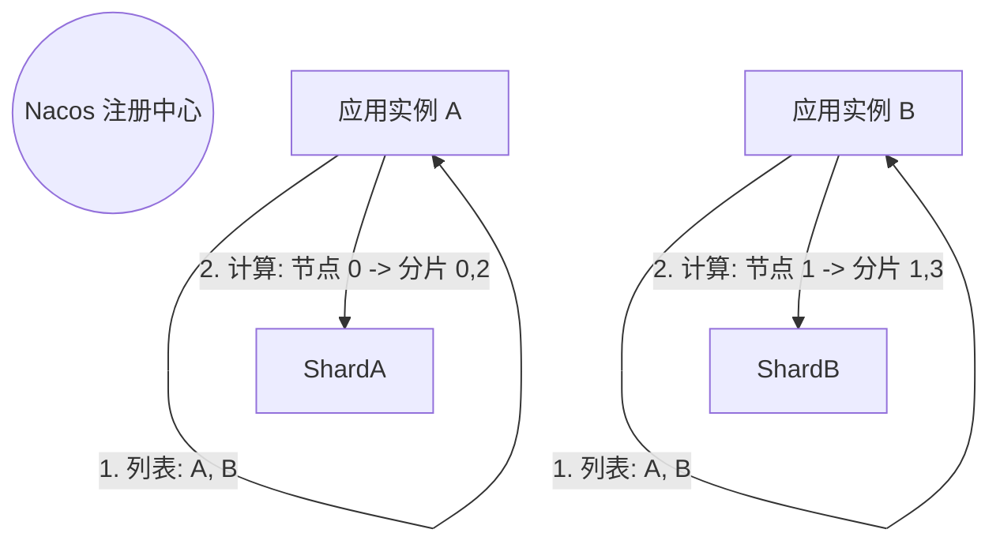
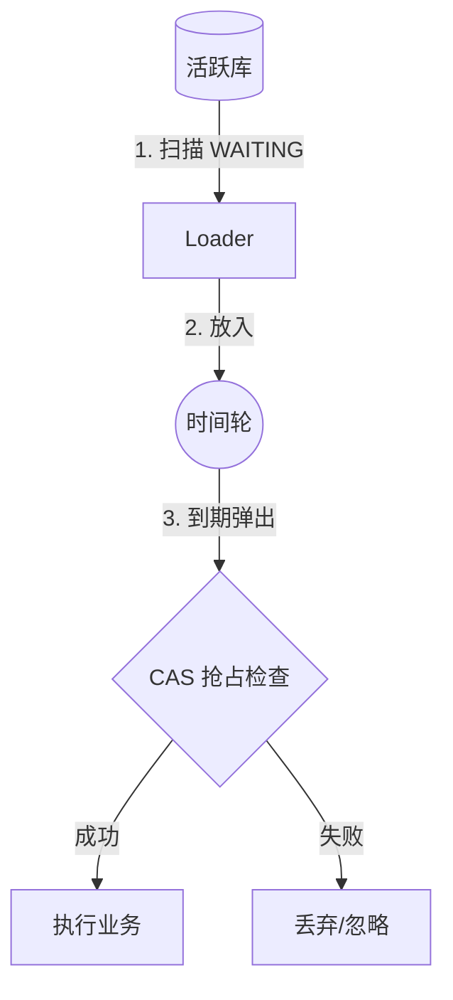

# 分布式 EasyRetry 架构设计方案

本文档概述了一个高可用、高性能的分布式重试系统架构。

## 1. 动态分片策略 (Nacos)

利用 Nacos 注册中心将分片逻辑与物理节点解耦。

### 1.1 动态扩缩容 (Rebalancing)
当实例数发生变化（如 8 -> 9）时，分片会自动重平衡。依靠 CAS 乐观锁保证在分片漂移瞬间的任务安全性。

## 2. 推荐配置与交互流程详解

**配置基准**:
*   **TotalShards**: 64 (应用层固定)
*   **物理实例**: 8~10 个 (动态)
*   **物理分表**: 2 张 (`_0`, `_1`) (存储层固定)

### 2.1 写入流程 (Insert) - RESTORED

一条重试记录从业务抛异常到落库的全过程。

1.  **应用层 (App Layer)**
    *   **构建**: 捕获异常，生成 `RetryTask`。
    *   **Id生成**: `bizId = "ORDER_123"`, `gmt_create = "2025-01-15"`.
    *   **逻辑分片**: 计算 `sharding = hash("ORDER_123") % 64` (假设结果为 **33**)。
    *   **DAO调用**: `retryTaskDAO.save(task)`。

2.  **路由层 (Sharding-JDBC)**
    *   **时间路由**: 提取 `gmt_create` -> 定位到 **`202501`** 月份组。
    *   **空间路由**: 提取 `bizId` 或 `sharding` -> 计算 `33 % 2 = 1` -> 定位到 **`_1`** 表。

3.  **物理层 (Storage Layer)**
    *   执行 SQL: `INSERT INTO retry_task_202501_1 ...`

### 2.2 读取流程 (Select)

**Q: 单个实例一次查询会扫几张表？**

查询条件: `gmt_create > NOW() - 30d` (跨越本月和上月)。

*   **Case A: 完美隔离 (如 8 实例)**
    *   **分配**: 实例 0 负责 `[0, 8, 16...]` (全偶数)。
    *   **路由**: 只命中 `_0` 表。
    *   **结果**: 扫 2 张表 (`202412_0`, `202501_0`)。

*   **Case B: 混合模式 (如 9 实例)**
    *   **分配**: 实例 0 负责混合奇偶分片。
    *   **路由**: 命中 `_0` 和 `_1` 表。
    *   **结果**: 扫 4 张表 (`202412_0/1` + `202501_0/1`)。
    *   **性能**: 并行查询，依然极快。

## 3. 高性能执行流程

利用 预读 + 时间轮 + CAS 乐观锁 解决执行瓶颈。

## 4. 存储策略：冷热分离

采用 "活跃 (Sharding-JDBC) / 归档 (Archive)" 分离策略。

*   **活跃表配置**:
    *   分片算法: `InlineShardingStrategy`
    *   表名表达式: `retry_task_$->{gmt_create.toString('yyyyMM')}_$->{biz_hash % 2}`
*   **周期轮转**:
    *   自动创建下月新表。
    *   定时任务清除 3 个月前的旧表 (直接 `DROP TABLE`)。
