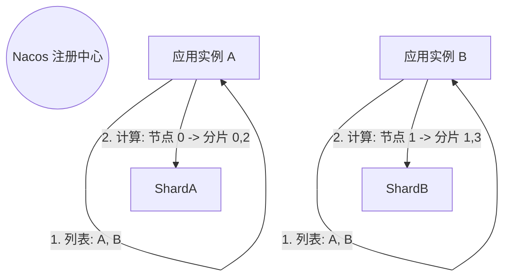
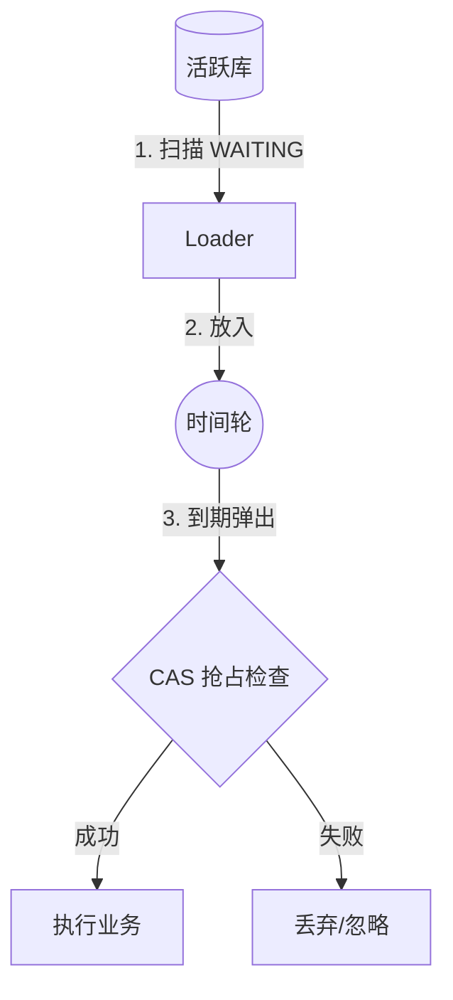

# 分布式 EasyRetry 架构设计方案

本文档概述了一个高可用、高性能的分布式重试系统架构。

## 1. 动态分片策略 (Nacos)

利用 Nacos 注册中心将分片逻辑与物理节点解耦。

### 1.1 动态扩缩容 (Rebalancing)

当实例数发生变化（如 8 -> 9）时，分片会自动重平衡。

*   **场景**: 从 8 个节点扩容到 9 个节点。
*   **触发**: Nacos 推送新的实例列表 (Size=9) 给所有节点。
*   **动作**: 所有节点重新执行分片算法 `ShardingUtil.allocate(myIndex, 9, 64)`。
*   **结果**:
    *   **Old (8 Nodes)**: 每个节点负载 8 个分片 (8 * 8 = 64)。
    *   **New (9 Nodes)**:
        *   前 1 个节点 (Index 0): 负责 8 个分片 (64/9 = 7 ... 1)。
        *   后 8 个节点 (Index 1-8): 负责 7 个分片。
    *   **迁移**: 原本属于旧节点的约 7 个分片会自动“漂移”到新加入的第 9 个节点上。
*   **安全性**: 依靠 **CAS 乐观锁**，即使在从 8 变 9 的瞬间（几毫秒内）由于网络延迟导致 A 和 B 认为自己都持有分片 0，执行前的 `UPDATE ... WHERE status='WAITING'` 也能保证只有一个能执行成功。

## 2. 推荐配置范例

基于 **TotalShards=64**, **实例数=8~10**, **物理分表=2或4张** 的参数分析。

### 2.1 兼容性验证
*   **分片映射 (Shards vs Tables)**
    *   **方案 A (2张表)**: `64 % 2 = 0`。每张物理表承载 32 个逻辑分片。完美兼容。
    *   **方案 B (4张表)**: `64 % 4 = 0`。每张物理表承载 16 个逻辑分片。完美兼容。
*   **负载均衡 (Shards vs Instances)**
    *   **8 实例**: 每实例 8 个分片。均衡度 100%。
    *   **10 实例**: 4个实例分7片，6个实例分6片。最大偏差 16.6%，**在可接受范围内**。

### 2.2 详细交互流程 (以 2 张表为例)

**场景**: 10 个实例中的实例 A (Index 0)，被分配了 7 个逻辑分片 `[0, 10, 20, 30, 40, 50, 60]`。

1.  **搬运线程 (Loader Thread - 实例 A)**
    *   **SQL**: `SELECT * FROM retry_task WHERE sharding IN (0, 10, 20, 30, 40, 50, 60)`
    *   *注: Index 0 的实例恰好拿到了一堆偶数 ID。*

2.  **Sharding-JDBC 代理**
    *   **路由规则**: `table_index = biz_hash % 2` (即 `sharding % 2`)。
    *   **计算**: `0%2=0`, `10%2=0` ... `60%2=0`。
    *   **结果**: 所有查询全部路由到 **表 `retry_task_xxxx_0`**。
    *   **优势**: 实例 A 与只负责奇数分片的实例完全物理隔离，互不争抢行锁。

## 3. 高性能执行流程

利用 预读 + 时间轮 + CAS 乐观锁 解决执行瓶颈。

## 4. 存储策略：冷热分离

采用 "活跃 (Sharding-JDBC) / 归档 (Archive)" 分离策略。

*   **活跃表配置**:
    *   分片算法: `InlineShardingStrategy`
    *   表名表达式: `retry_task_$->{gmt_create.toString('yyyyMM')}_$->{biz_hash % 2}` (或 % 4)
*   **周期轮转**:
    *   自动创建下月新表 (如 `retry_task_202502_0`, `retry_task_202502_1`)。
    *   定时任务清除 3 个月前的旧表 (直接 `DROP TABLE`)。
