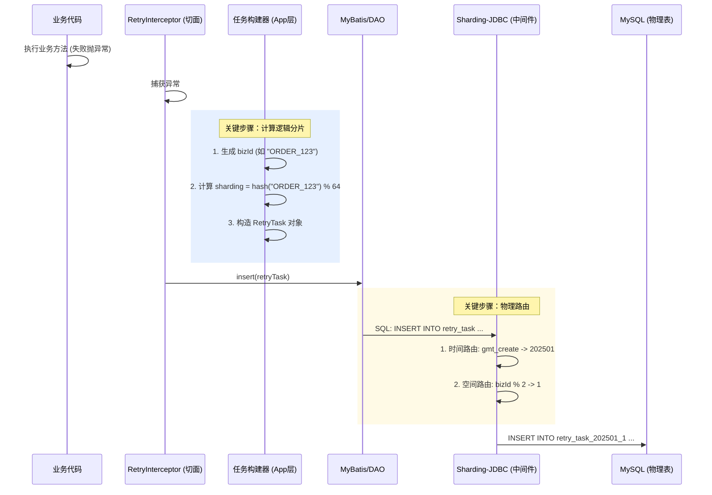

2. 详细步骤拆解
假设全局配置为：TotalShards=64, 物理分表=2张 (_0, _1)。 业务场景：用户发起退款，bizId 为 REFUND_888。
 第一阶段：应用层组装 (Application Layer)
    1. 触发拦截:
            业务方法执行失败，@EasyRetryable 切面捕获异常。
    2. 构建任务 (Task Building):
            框架创建一个 RetryTaskPO 对象。
            生成业务ID: 提取参数中的 REFUND_888 作为 bizId。
    3. 计算逻辑分片 (Logical Sharding):
            这是应用层唯一要做的事。
            算法: Math.abs("REFUND_888".hashCode()) % 64。
            假设算出来结果是 33。
             代码动作: retryTask.setSharding("33")。
    4. 发起保存:
            调用 MyBatis: retryTaskDAO.save(retryTask)。
               发出的 原始 SQL:
               sql
                 INSERT INTO retry_task (biz_id, sharding, gmt_create, ...)
                 VALUES ('REFUND_888', 33, '2025-01-01 12:00:00', ...);

第二阶段：中间件路由 (Middleware Layer)
Sharding-JDBC 拦截到这条 INSERT 语句，开始进行双重路由计算：

时间路由 (定位逻辑表/库):
    提取 gmt_create = '2025-01-01'。
    根据配置（按月分表），定位到逻辑表群组 202501。
空间路由 (定位物理表):
    提取分片键 biz_id = 'REFUND_888' (或者直接用 sharding 字段，取决于你 Sharding-JDBC 怎么配)。
    强烈建议配置 Sharding-JDBC 的分片规则和应用层保持一致的“同源算法”，即也是基于 Hash。
    算法: hash("REFUND_888") % 2。
    假设 33 是奇数，那么 REFUND_888 的 Hash 通常也是奇数（如果算法一致）。
    计算结果: 1。
改写 SQL:
    Sharding-JDBC 将逻辑表名 retry_task 替换为真实的物理表名。
    最终 SQL:
        sql
        INSERT INTO retry_task_202501_1 (biz_id, sharding, ...)
        VALUES ('REFUND_888', 33, ...);

第三阶段：物理落库 (Storage Layer)
数据库收到 SQL，将数据写入 retry_task_202501_1 表。
注意：虽然这张表叫 ..._1，但它里面存储的记录，其 sharding 字段不仅仅是 33，还可能是 1, 3, 5, ... 63 等所有奇数逻辑分片的数据。

总结
应用层只管 “全班排座位” (算出你是第 33 号座位)。
存储层只管 “分考场” (单号去一考场，双号去二考场)。
结果: 第 33 号座位的同学，最终坐在了由于 Sharding-JDBC 路由指定的那个物理表里。这一过程对业务代码是完全无感的。