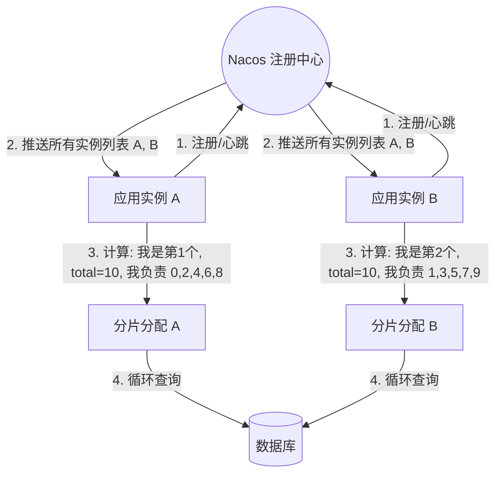
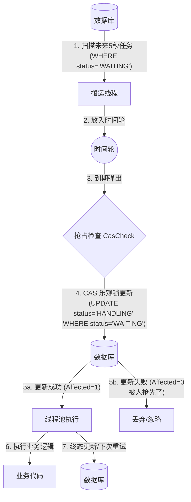
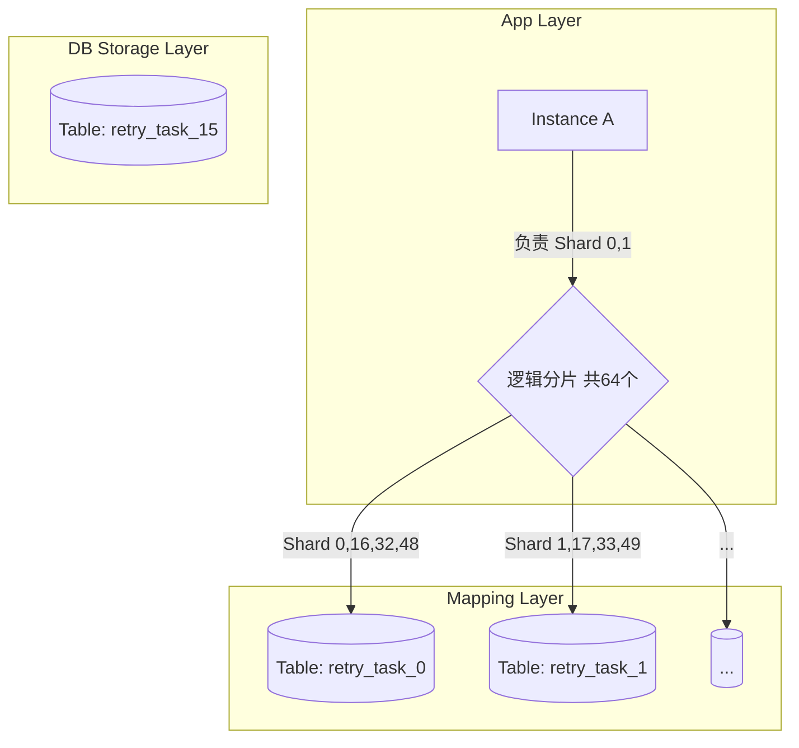

# 多实例分片

# 执行

# 存储层-表分片-hash方式

## 
这里的关键点是“解耦”
虽然表只有 16 张，但系统逻辑层面认定的“最小单元”依然是 64 个逻辑分片 (Shards)。

现状: 平均每张表里混装了 4 个逻辑分片的数据。
    表 retry_task_0 里面存了: sharding=0, sharding=16, sharding=32, sharding=48 的所有数据。
好处 (为什么不直接用 sharding % 16?):
    如果未来数据量爆了，你需要扩容到 32 张表。
    如果是直接取模 (hash % 16): 完蛋了，数据全乱了，你需要把所有 16 张表的数据导出来，重新计算 hash % 32，再灌入新表。这是伤筋动骨的。
    如果是逻辑分片 (hash % 64): 你只需要做“数据拆分”。
        原本 retry_task_0 存了 4 份数据 (0, 16, 32, 48)。
        现在你把 sharding=32, 48 的数据搬运到新的 retry_task_16 表去。
        表 retry_task_0 只留 sharding=0, 16。
        SQL 逻辑非常清晰，不用重新计算 Hash，只是按 sharding 字段搬运。
所以在设计之初，“逻辑分片数量 (TotalShards)” 一定要设得比 “物理表数量 (TotalTables)” 大，通常建议是物理表的整数倍（如 4倍、8倍），为未来留后路。

# 存储层-表分片-时间方式(范围方式)
按时间分表（例如 retry_task_202501, retry_task_202502）在日志、流水型业务中非常常见，但对于重试任务（Retry Task）这种场景，通常是不推荐的。
为什么重试任务不适合按时间分表？
查询维度的冲突
    按时间分表的前提：你的查询条件里必须带上时间且范围收敛。
    重试的查询逻辑：是由调度器去拉取 “当前未完成的任务”。
        一个任务可能是在 2024年12月 创建的，重试了几次失败了，变成了 2025年1月 需要继续重试。
        如果此时你在 1 月份的表里查，可能查不到它（因为它在 12 月的表里）。
        这就要求调度器必须同时扫描所有历史表（或者维护一个活跃表列表），这非常低效且容易遗漏。
存活周期极短
    重试任务通常是“短命”的。99% 的任务在几分钟内就成功并完结了。
    完结的任务通常会被归档或删除。
    如果是按时间分表，你的 retry_task_202501 表里，到了 1 月中旬，可能 99% 的数据都是 FINISH 状态的垃圾数据，只有零星几个还在重试。你需要频繁地跨表维护状态。
热点问题
    写热点：所有的 INSERT 都会集中在“当月/当天”这一张表上。其他的历史表全是冷的。
    这意味着你不仅没有利用多表的 IO 能力，反而把压力全压在了一张表上，失去了分表的意义（分表通常是为了把写压力分摊到不同磁盘上）。

什么时候可以用时间分表？
只有一种情况：“任务历史归档” (Archive)。
    活跃表 (Running): 使用 Hash 取模分表（如 16 张），只存当前正在重试中的任务。
    归档表 (History): 任务一旦执行成功 (FINISH) 或者彻底失败 (STOP)，把它从活跃表里物理删除，然后搬运到 retry_task_history_202501 时间表里。
        这样活跃表永远保持小巧、高性能。
        历史表用于事后排查、审计、对账，按月归档，方便冷热分离。